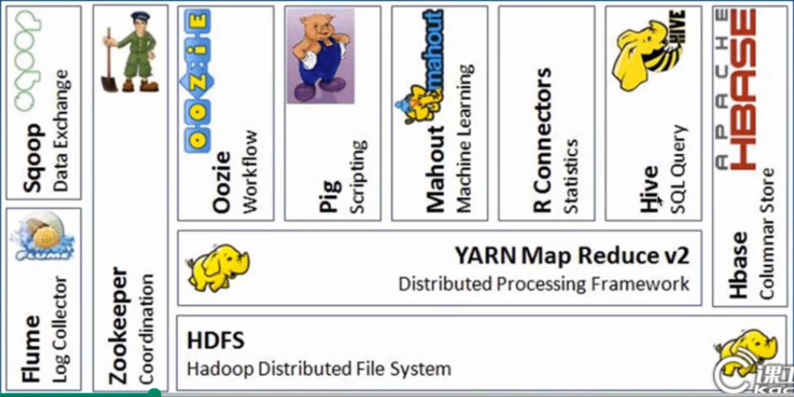
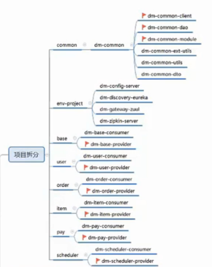

##  大数据：

#### 概念：

​	存储容量，读写数据，计算效率  

​	MapReduce:	分布式计算

​	BigTable: 

​	GFS: 分布式集群，存储容量不够添加机器扩张存储容量

​	

##### 	**Hadoop**组成: 


​					HDFS:分布式文件系统，大量数据存储

​					Hadoop Yarn:  资源管理系统，调度

​					MapReduce:  分布式计算框架，处理map，reduce 打包，提交运行

​					Hbase: 链式存储系统数据库，海量的数据查询

​					Hive：sql语句提交到hive，翻译成mapreduce作业，提交到集群运行

​					Pig：脚本，大数据分析操作

​					Oozie：工作流

​					Flume： 搬运日志收集日志

​					Sqoop：导入哒数据




##### **HDFS 优点**： 

​	容错率，

​	流式数据访问

​	大亏莫数据集 

​	**移动计算比移动数据效率更高** （任务调度）

​	


## 双11抢购：

#### 抢购流程：

![5S~6SFN[]`NG@U9IN05SZ{B](assets/5S~6SFN[]`NG@U9IN05SZ{B.png)

#### 引发问题：

​		高并发，线程安全


#### docker 命令

```java
//安装docker
apt‐get install ‐y docker.io
//镜像
docker image/serach/pull
//查看容器列表 （否则只查询启动容器）
docker ps -a

//启动	后台运行  (容器端口号：宿主机号)   外界无法直接访问docker容器
docker run -d -p 8080:8080 --name tomcat-tes tomcat
//进入容器  开启输入 终端
docker exec -it id /bin/bash
//退出容器
exit
//停止容器 删除容器
docker stop/rm id
//拷贝进容器
docker cp index.jsp 容器id:/user/local/tomcat/webapps/ROOT
//容器中烤出来
docker cp 容器id:/user/local/tomcat/webapps/ROOT /
    
//Potainer (外链)	
docker volume create portainer_data
docker run -d -p 9010:9000 j'j-v /var/run/docker.sock -v portainer_data:/data portainer/portainer

//创建镜像
docker build -t elasticsearch Elasticsearch
//通过别名进行访问		   新创建容器名字                 连接的容器名字              所用镜像
docker run -d -it --name kibana -p 5601:5601 --link elasticsearch:elasticsearch kibana


```

**Dockerfile：**


```java
//来源镜像
FROM tomcat
//作者
MAINTAINER ...
//复制文件到镜像中
COPY index,jsp /user/local/tomcat/webapps/ROOT/
//docker cp 复制文件到已经启动好的容器中
```


**DubbleX：** 

```
mvn install -Dmaven.test.skip=true
```

#### 项目结构：


maven 多模块

common-module provdier,consumer

common-utils

common-dto

common-service


## 被问到：

#### 定时器：

JAVA中有专门可以实现定时器功能的类：**Timer**类和**TimerTask**类：

Timer是一种定时器工具，用来在一个后台线程计划执行指定任务，而TimerTask是一个抽象类，它的子类代表一个可以被Timer计划的任务。

在工具类Timer中，提供了四个构造方法，每个构造方法都启动了计时器线程，同时Timer类可以保证多个线程可以共享单个Timer对象而无需进行外部同步，所以Timer类是线程安全的。


#### 还要重写hashcode


**主要是在一些集合里边比如在hashmap**中为了快速进行比较，首先要使用hashcode方法比较hash值是否相等，如果相等就会，在会使用equals方法进行比较。如果hashcode方法比较的hash值不相等，就会比较直接返回fault，不会再比较equals


#### JDBC 与 ODBC

JDBC表示Java****数据库连接，是一种应用程序编程接口，即API****。**

**ODBC****是开放式数据库连接。与JDBC****一样，ODBC****也是一个API****，充当客户端应用程序和服务器端数据库之间的接口。**

1、JDBC****代表java****数据库连接，是面向对象的。而ODBC****代表开放式数据库连接，是程序性的。**

 

2、JDBC****只能将其用于Java****语言开发的程序中，可以在任何平台上使用；ODBC****可以将其用于任何语言，如C****，C ++****等本地语言开发的ODBC****驱动程序，仅可以选择在Windows****平台上使用。**

 

3、对于Java****应用程序，不建议使用ODBC****，因为内部转换会导致性能下降，应用程序将变为平台相关；强烈建议使用JDBC****，因为我们没有性能和平台相关的问题。**

 

4、ODBC****的代码很复杂，很难学习。但是，JDBC****的代码更简单，更容易运行。**


#### 怎么查看有没有使用索引

在查询语句 select 关键字前 加入使用解释函数explain，只需添加在sql语句之前即可


#### redis 模拟map

原理：利用两个Map，一个map用来存储值，一个map用来存储过期时间。另外有一个线程，定期去扫描那些key过期，如果过期，则移除这个值。
要使用ConcurrentHashMap解决线程安全。

```java
/**
 * 
 */
package com.yihu.util.mapRedis;
 
import java.util.ArrayList;
import java.util.Iterator;
import java.util.List;
import java.util.Map;
import java.util.concurrent.ConcurrentHashMap;
 
 
 
/**
 * 使用Map实现redis的功能
 * @author lch 201705
 *
 */
public class MapForRedisUtils extends Thread {
	private static MapForRedisUtils mapForRedisUtils=null;
	private static Map<String,String> map=new ConcurrentHashMap<String,String>();
	private static Map<String,Long> expireMap=new ConcurrentHashMap<String,Long>();
	
	/**
	 * 存储值
	 * @param key 健
	 * @param val 值
	 * @param minute  过期时间(分钟)
	 */
	public static void setValue(String key,String val,int minute){
		try{
			map.put(key,val);
			expireMap.put(key,System.currentTimeMillis()+minute*60L*1000);
		}catch(Exception e){
			e.printStackTrace();
		}
	}
	
	/**
	 * 获取值
	 * @param key 健
	 */
	public static String getValue(String key){
		try{
			return map.get(key);
		}catch(Exception e){
			e.printStackTrace();
			return null;
		}
	}	
 
	
	/**
	 * 获取过期时间（相对于1970-1-1的毫秒数)
	 * @param key 健
	 */
	public static long getExpireTime(String key){
		try{
			return expireMap.get(key);
		}catch(Exception e){
			e.printStackTrace();
			return 0;
		}
	}
 
	/**
	 * 设置过期时间（毫秒数)
	 * @param key 健
	 * @param expireMills 多少毫秒
	 */
	public static long setExpireTime(String key,int minute){
		try{
			return expireMap.put(key,System.currentTimeMillis()+minute*60L*1000);
		}catch(Exception e){
			e.printStackTrace();
			return 0;
		}
	}
	
	@Override
	public void run() {
		while(true){
			try{
				
				//移除过期的数据
				List<String> needRemoveKey=new ArrayList<String>();
				for (Map.Entry<String, Long> entry : MapForRedisUtils.expireMap.entrySet()) {
					if(entry.getValue()!=null&&entry.getValue()<=System.currentTimeMillis()){
						needRemoveKey.add(entry.getKey());
					}
				}
				for(String key:needRemoveKey){
					map.remove(key);
					expireMap.remove(key);
				}
				
				try {
					Thread.sleep(10000);//暂停10秒钟，变成死循环
				} catch (Exception e1) {
					e1.printStackTrace();
				}
			}catch(Exception e){
				try {
					Thread.sleep(1000);//防止故障的时候，变成死循环
				} catch (Exception e1) {
					e1.printStackTrace();
				}
			}
		}
	}
	
	
	public static void init(){
		if(mapForRedisUtils==null){
			mapForRedisUtils=new MapForRedisUtils();
			mapForRedisUtils.start();//启动监视线程（自动删除过期的数据)
		}
	}
	
	public static void main(String[] args) throws InterruptedException {
		MapForRedisUtils.init();
		MapForRedisUtils.setValue("test", "1111111", 1);//设置值
		System.out.println(MapForRedisUtils.getValue("test"));//读取值
		Thread.sleep(2*60*1000);
		System.out.println("2 min after,val="+MapForRedisUtils.getValue("test"));//数据过期之后，再去读取，就发现没有了
	}
}
```


#### 单元测试覆盖率：

每一个方法，每一个单元测试包括异常 ，if 包含2个单元测试

每一个分支都要有：

sonar 扫描ut覆盖率80%


#### Lambda 异常处理：

**对于非受检异常，使用包装方法来进行处理：**

简单来说，就是将本来要传入的Consumer接口的实现，传入handlingConsumerWrapper方法中，并对其中的异常进行处理，然后再返回一个Consumer接口的实现。

这样来处理，在lambda中既可以处理异常又可以保证代码的简洁。不会让lambda显得很臃肿。


对于受检异常，需要自己定义一个函数接口：

这里实际上是定义了一个函数接口ThrowingConsumer，ThrowingConsumer的方法和Consumer接口一致，只不过抛出了异常，这样我们才可以在包装方法中处理受检异常。


上述两种方法实际上都是将异常在包装方法中进行了处理。下面说一下一定要将异常抛出方法的情况：


可以看到，其实大体上和try-catch的处理是基本一致的。只不过在将异常catch之后，将异常全部作为非受检异常抛了出去。但是这种情况就可以将异常都上抛给调用的方法进行处理了。


#### lambda 优缺点：

最近接触到 lambda 表达式后，发现它基本上可以消灭所有 for 循环，换句话说，所有的 for 循环都能被 lambda 表达式改写。

但我发现，它并不是特别完美的，经过我查阅国内外不少网站的资料，加上自己试验，总结出以下几点：

 

优点：

1. 简洁。

2. 非常容易并行计算。

3. 可能代表未来的编程趋势。

4. 结合 hashmap 的 computeIfAbsent 方法，递归运算非常快。java有针对递归的专门优化。

 

缺点：

1. 若不用并行计算，很多时候计算速度没有比传统的 for 循环快。（并行计算有时需要预热才显示出效率优势，并行计算目前对 Collection 类型支持的好，对其他类型支持的一般）

2. 不容易调试。

3. 若其他程序员没有学过 lambda 表达式，代码不容易让其他语言的程序员看懂。

4. 在 lambda 语句中强制类型转换貌似不方便，一定要搞清楚到底是 map 还是 mapToDouble 还是 mapToInt


#### 调用了synchronize关键字

1.[如果一个对象的一个方法用了synchronize关键字](http://www.zhihu.com/question/20518190) 假定该方法是A ()
分为两种情况 
<1> A是static的 分为2种情况 
       a.其他方法是synchronized 或没加锁的  那么其他的线程可以访问该对象的其他方法
       b.其他方法是static  synchronized   不可以访问
<2>A是非static的 那么又分三种情况
a.其他方法是synchronize 不可访问
b.其他方法没有加synchronize 可以访问
c.其他方法是 static synchronized 可以访问


#### try -return

**结论：
1、不管有没有出现异常，finally块中代码都会执行；
2、当try和catch中有return时，finally仍然会执行；
3、finally是在return后面的表达式运算后执行的（此时并没有返回运算后的值，而是先把要返回的值保存起来，不管finally中的代码怎么样，返回的值都不会改变，任然是之前保存的值），所以函数返回值是在finally执行前确定的；
4、finally中最好不要包含return，否则程序会提前退出，返回值不是try或catch中保存的返回值。
举例：**
*情况1*：try{} catch(){}finally{} return;
            显然程序按顺序执行。
*情况2*:try{ return; }catch(){} finally{} return;
          程序执行try块中return之前（包括return语句中的表达式运算）代码；
         再执行finally块，最后执行try中return;
         finally块之后的语句return，因为程序在try中已经return所以不再执行。
*情况3*:try{ } catch(){return;} finally{} return;
         程序先执行try，如果遇到异常执行catch块，
         有异常：则执行catch中return之前（包括return语句中的表达式运算）代码，再执行finally语句中全部代码，
                     最后执行catch块中return. finally之后也就是4处的代码不再执行。
         无异常：执行完try再finally再return.
*情况4*:try{ return; }catch(){} finally{return;}
          程序执行try块中return之前（包括return语句中的表达式运算）代码；
          再执行finally块，因为finally块中有return所以提前退出。
*情况5*:try{} catch(){return;}finally{return;}
          程序执行catch块中return之前（包括return语句中的表达式运算）代码；
          再执行finally块，因为finally块中有return所以提前退出。
*情况6*:try{ return;}catch(){return;} finally{return;}
          程序执行try块中return之前（包括return语句中的表达式运算）代码；
          有异常：执行catch块中return之前（包括return语句中的表达式运算）代码；
                       则再执行finally块，因为finally块中有return所以提前退出。
          无异常：则再执行finally块，因为finally块中有return所以提前退出。
**最终结论**：任何执行try 或者catch中的return语句之前，都会先执行finally语句，如果finally存在的话。
                  如果finally中有return语句，那么程序就return了，所以finally中的return是一定会被return的，
                  编译器把finally中的return实现为一个warning。


## 问答题：


#### 项目部署：

**一台web，一台数据库 一台资源**


1.先要将将项目中本来的jar包清除一下，这里我们其实只关注每个工程target夹中的jar包。

Maven Clean

项目右键，run as->maven build...

java -jar xxxxxxxx.jar

即可。

为了方便，我们这里一般写好脚本，就这一行代码，保存为.bat后，双击该文件项目就会运行了。


部署到tomcat

准备 3 个 tomcat

备注：也可以部署在同一个 tomcat 下，但是如果有问题不好排查

分别部署 ehl-eureka-server1，apps-is，appsweb

1、修改 war 包名为 application.yml 文件中 server.context-path 的名字

2、分别修改 tomcat 端口为 server.port 的端口为

| ehl-eureka-server1 | apps-is | appsweb |
| ------------------ | ------- | ------- |
| 8761               | 8762    | 8765    |
| 8009               | 8010    | 8011    |
| 8005               | 8006    | 8007    |


```
set JAVA_HOME=C:\Program Files\Java\jdk1.8.0_131

set TOMCAT_HOME=D:\soft\apache-tomcat-8.5.34-windows-x64\apache-tomcat-8.5.34-01

set CATALINA_HOME=D:\soft\apache-tomcat-8.5.34-windows-x64\apache-tomcat-8.5.34-01
```


#### linux 命令：

###### **常用指令：**

```linu
ls　　        显示文件或目录
-l           列出文件详细信息l(list)
-a           列出当前目录下所有文件及目录，包括隐藏的a(all)
mkdir         创建目录
-p            创建目录，若无父目录，则创建p(parent)
cd               切换目录
touch          创建空文件
echo            创建带有内容的文件。
cat              查看文件内容
cp                拷贝
mv               移动或重命名
rm               删除文件
-r            递归删除，可删除子目录及文件
-f            强制删除
find              在文件系统中搜索某文件
wc                统计文本中行数、字数、字符数
grep             在文本文件中查找某个字符串
rmdir           删除空目录
tree             树形结构显示目录，需要安装tree包
pwd              显示当前目录
ln                  创建链接文件
more、less  分页显示文本文件内容
head、tail    显示文件头、尾内容
ctrl+alt+F1  命令行全屏模式

```


###### **系统命令：**

```
stat              显示指定文件的详细信息，比ls更详细
who               显示在线登陆用户
whoami          显示当前操作用户
hostname      显示主机名
uname           显示系统信息
top                动态显示当前耗费资源最多进程信息
ps                  显示瞬间进程状态 ps -aux
du                  查看目录大小 du -h /home带有单位显示目录信息
df                  查看磁盘大小 df -h 带有单位显示磁盘信息
ifconfig          查看网络情况
ping                测试网络连通
netstat          显示网络状态信
man                命令不会用了，找男人  如：man ls
clear              清屏
alias               对命令重命名 如：alias showmeit="ps -aux" ，另外解除使用unaliax showmeit
kill                 杀死进程，可以先用ps 或 top命令查看进程的id，然后再用kill命令杀死进程。

```


###### **打包压缩配置：**

```
gzip：
bzip2：
tar:                打包压缩
     -c              归档文件
     -x              压缩文件
     -z              gzip压缩文件
     -j              bzip2压缩文件
     -v              显示压缩或解压缩过程 v(view)
     -f              使用档名

例：
tar -cvf /home/abc.tar /home/abc              只打包，不压缩
tar -zcvf /home/abc.tar.gz /home/abc        打包，并用gzip压缩
tar -jcvf /home/abc.tar.bz2 /home/abc      打包，并用bzip2压缩
当然，如果想解压缩，就直接替换上面的命令  tar -cvf  / tar -zcvf  / tar -jcvf 中的“c” 换成“x” 就可以了。

```
---
###### 关机/重启机器
 -r             关机重启
 -h             关机不重启
 now          立刻关机
 halt 关机
reboot 重启

```


###### **sudo**

```
sudo dpkg -i tree_1.5.3-1_i386.deb 安装软件
sudo dpkg -r tree 卸载软件
注：将tree.deb传到Linux系统中，有多种方式。VMwareTool，使用挂载方式；使用winSCP工具等；
APT（Advanced Packaging Tool）高级软件工具。这种方法适合系统能够连接互联网的情况。
依然以tree为例
sudo apt-get install tree 安装tree
sudo apt-get remove tree 卸载tree
sudo apt-get update 更新软件
sudo apt-get upgrade
将.rpm文件转为.deb文件
.rpm为RedHat使用的软件格式。在Ubuntu下不能直接使用，所以需要转换一下。
sudo alien abc.rpm
```


###### **vim使用**

```
vim三种模式：命令模式、插入模式、编辑模式。使用ESC或i或：来切换模式。
命令模式下：
:q                      退出
:q!                     强制退出
:wq                   保存并退出
:set number     显示行号
:set nonumber  隐藏行号
/apache            在文档中查找apache 按n跳到下一个，shift+n上一个
yyp                   复制光标所在行，并粘贴
/etc/passwd 存储用户账号
/etc/group 存储组账号
/etc/shadow 存储用户账号的密码
/etc/gshadow 存储用户组账号的密码
useradd 用户名
userdel 用户名
adduser 用户名
groupadd 组名
groupdel 组名
passwd root 给root设置密码
su root
su - root
/etc/profile 系统环境变量
bash_profile 用户环境变量
.bashrc 用户环境变量
su user 切换用户，加载配置文件.bashrc
su - user 切换用户，加载配置文件/etc/profile ，加载bash_profile


#### Hashmap 1.7 vs 1.8

https://mp.weixin.qq.com/s/KU2Sh0p8T9RMe-j7U4OJ7g


#### Tomcat优化：

```


一、掉对web.xml的监视，把jsp提前编辑成Servlet。有富余物理内存的情况，加大tomcat使用的jvm的内存


二、服务器资源
　　服务器所能提供CPU、内存、硬盘的性能对处理能力有决定性影响。
　　(1) 对于高并发情况下会有大量的运算，那么CPU的速度会直接影响到处理速度。
　　(2) 内存在大量数据处理的情况下，将会有较大的内存容量需求，可以用-Xmx -Xms -XX:MaxPermSize等参数对内存不同功能块进行划分。我们之前就遇到过内存分配不足，导致虚拟机一直处于full GC，从而导致处理能力严重下降。
　　(3) 硬盘主要问题就是读写性能，当大量文件进行读写时，磁盘极容易成为性能瓶颈。最好的办法还是利用下面提到的缓存。


三、利用缓存和压缩
　　对于静态页面最好是能够缓存起来，这样就不必每次从磁盘上读。这里我们采用了Nginx作为缓存服务器，将图片、css、js文件都进行了缓存，有效的减少了后端tomcat的访问。
　　另外，为了能加快网络传输速度，开启gzip压缩也是必不可少的。但考虑到tomcat已经需要处理很多东西了，所以把这个压缩的工作就交给前端的Nginx来完成。
　　除了文本可以用gzip压缩，其实很多图片也可以用图像处理工具预先进行压缩，找到一个平衡点可以让画质损失很小而文件可以减小很多。曾经我就见过一个图片从300多kb压缩到几十kb，自己几乎看不出来区别。


 四、采用集群
　　单个服务器性能总是有限的，最好的办法自然是实现横向扩展，那么组建tomcat集群是有效提升性能的手段。我们还是采用了Nginx来作为请求分流的服务器，后端多个tomcat共享session来协同工作。可以参考之前写的《利用nginx+tomcat+memcached组建web服务器负载均衡》。


五、 优化tomcat参数
　　这里以tomcat7的参数配置为例，需要修改conf/server.xml文件，主要是优化连接配置，关闭客户端dns查询。

​```java
<Connector port="8080"   
           protocol="org.apache.coyote.http11.Http11NioProtocol"  
           connectionTimeout="20000"  
           redirectPort="8443"   
           maxThreads="500"   
           minSpareThreads="20"  
           acceptCount="100" 
           disableUploadTimeout="true" 
           enableLookups="false"   
           URIEncoding="UTF-8" /> 
```


#### git 命令：

git pull vs git fetch：

git fetch`是将远程主机的最新内容拉到本地，用户在检查了以后决定是否合并到工作本机分支中。

而`git pull` 则是将远程主机的最新内容拉下来后直接合并，即：`git pull = git fetch + git merge`，这样可能会产生冲突，需要手动解决。


**一、本地操作：**

**1.其它**

git init：初始化本地库

git status：查看工作区、暂存区的状态

git add <file name>：将工作区的“新建/修改”添加到暂存区

git rm --cached <file name>：移除暂存区的修改

git commit <file name>：将暂存区的内容提交到本地库

　　tip：需要再编辑提交日志，比较麻烦，建议用下面带参数的提交方法

git commit -m "提交日志" <file name>：文件从暂存区到本地库

 

**二、本地库跟远程库交互：**

git clone <远程库地址>：克隆远程库

　　功能：①完整的克隆远程库为本地库，②为本地库新建origin别名，③初始化本地库

git remote -v：查看远程库地址别名

git remote add <别名> <远程库地址>：新建远程库地址别名

git remote rm <别名>：删除本地中远程库别名

git push <别名> <分支名>：本地库某个分支推送到远程库，分支必须指定

git pull <别名> <分支名>：把远程库的修改拉取到本地

　　tip：该命令包括git fetch，git merge

git fetch <远程库别名> <远程库分支名>：抓取远程库的指定分支到本地，但没有合并

git merge <远程库别名/远程库分支名>：将抓取下来的远程的分支，跟当前所在分支进行合并

git fork：复制远程库

　　tip：一般是外面团队的开发人员fork本团队项目，然后进行开发，之后外面团队发起pull   request，然后本团队进行审核，如无问题本团队进行merge（合并）到团队自己的远程库，整个流程就是本团队跟外面团队的协同开发流程，Linux的团队开发成员即为这种工作方式。


**2.日志**

git log：查看历史提交

　　tip：空格向下翻页，b向上翻页，q退出

git log --pretty=oneline：以漂亮的一行显示，包含全部哈希索引值

git log --oneline：以简洁的一行显示，包含简洁哈希索引值

git reflog：以简洁的一行显示，包含简洁哈希索引值，同时显示移动到某个历史版本所需的步数

 

**3.版本控制**

git reset --hard 简洁/完整哈希索引值：回到指定哈希值所对应的版本

git reset --hard HEAD：强制工作区、暂存区、本地库为当前HEAD指针所在的版本

git reset --hard HEAD^：后退一个版本　　

　　tip：一个^表示回退一个版本

git reset --hard HEAD~1：后退一个版本

　　tip：波浪线~后面的数字表示后退几个版本

 

**4.比较差异**

git diff：比较工作区和暂存区的**所有文件**差异

git diff <file name>：比较工作区和暂存区的**指定文件**的差异

git diff HEAD|HEAD^|HEAD~|哈希索引值 <file name>：比较工作区跟本地库的某个版本的**指定文件**的差异

 

**5.分支操作**

git branch -v：查看所有分支

git branch -d <分支名>：删除本地分支

git branch <分支名>：新建分支

git checkout <分支名>：切换分支

git merge <被合并分支名>：合并分支

　　tip：如master分支合并 hot_fix分支，那么当前必须处于master分支上，然后执行 git merge hot_fix 命令

　　tip2：合并出现冲突

　　　　①删除git自动标记符号，如<<<<<<< HEAD、>>>>>>>等

　　　　②修改到满意后，保存退出

　　　　③git add <file name>

　　　　④git commit -m "日志信息"，此时后面不要带文件名


#### Git vs SVN：

**GIT更倾向于被使用于分布式模式**，也就是每个开发人员从中心版本库/服务器上chect out代码后会在自己的机器上克隆一个自己的版本库。

你只需要创建一个分支，向项目团队发送一个推请求。这能让你的代码保持最新，而且不会在传输过程中丢失。


GIT **把内容按元数据方式存储，而SVN是按文件：**

git目录是处于你的机器上的一个克隆版的版本库，它拥有中心版本库上所有的东西，例如标签，分 支，版本记录等。


**GIT****分支和SVN的分支不同：**

svn：就是版本库中的另外的一个目录。

处理GIT的分支却是相当的简单和有趣。你可以从同一个工作目录下快速的在几个分支间切换。你很容易发现未被合并的分支，你能简单而快捷的合并这些文件。


**4.GIT****没有一个全局的版本号，而SVN有：**


#### Maven 私服：

下载nexus安装包 传到远程服务器，设置端口号8081 ./nexus 启动

登陆后在面板中 创建仓库，需要改代理地址为阿里地址

项目中客户端添加用户配置

```java
<server>
    <id>maven-releases</id>
    <username>admin</username>
    <password>admin123</password>
</server>
```

改为私服的群组仓库地址

再把snapshot去掉之后，再执行deploy


#### MYSQL VS ORACLE:

mysql使用三个参数来验证用户，即用户名，密码和位置

mysql一般使用自动增长类型，在创建表的时候指定表的主键为auto increment，主键就会自动增长

mysql则对引号没有限制

**mysql分页查询使用关键字limit来实现**

mysql中的整型：int（），字符串类型：varchar（）


Oracle使用了更多的安全功能，如用户名，密码，配置文件，本地身份验证，外部身份验证，高级安全增强功能等

Oracle中没有自动增长，主键一般使用序列，插值时依次赋值即可。

Oracle不使用双引号，会报错

**Oracle没有实现分页查询的关键字，实现起来较复杂，在每个结果集中只有一个rownum字段标明它的位置，并且只能用rownum<=某个数，不能用rownum>=某个数，因为ROWNUM是伪列，在使用时所以需要为ROWNUM取一个别名，变成逻辑列，然后来操作。**

Oracle中的整形：number（），字符串类型：varchar2（）


#### 跨域问题：

意为跨域资源共享。当一个资源去访问另一个不同域名或者同域名不同端口的资源时，

**JSONP**: 基本原理就是通过动态创建script标签,然后利用src属性进行跨域,但是要注意JSONP只支持GET请求，不支持POST请求。 修改datatype ：jsonp


**CORS**：

```
利用nginx或者php、java等后端语言设置允许跨域请求

服务端增加一个响应头
header('Access-Control-Allow-Origin:*');//允许所有来源访问
header('Access-Control-Allow-Method:POST,GET');//允许访问的方式
```


浏览器有跨域限制，但是服务器不存在跨域问题，所以可以由服务器请求所要域的资源再返回给客户端。

**Nginx：**

```java
server {
    listen       80 default_server;
    listen       [::]:80 default_server;
    server_name  _;
    root         /usr/share/nginx/html;
    # Load configuration files for the default server block.
    include /etc/nginx/default.d/*.conf;
    location / {
            #支持其他请求
            add_header Access-Control-Allow-Methods PUT;
            #设置预检请求的缓存
            add_header Access-Control-Max-Age 3600;
            #允许Cookie
            add_header Access-Control-Allow-Credentials true;
            #这里最好做判断，怕麻烦的话就写*，但是不建议
            if ($http_origin = http://localhost){
                    add_header Access-Control-Allow-Origin http://localhost;
            }
            if ($http_origin = http://127.0.0.1){
                    add_header Access-Control-Allow-Origin http://127.0.0.1;
            }
            #为了方便，这样写了
            add_header Access-Control-Allow-Headers $http_access_control_request_headers;
            if ($request_method = OPTIONS){
                    return 200;
            }
    }
    error_page 404 /404.html;
        location = /40x.html {
    }
    error_page 500 502 503 504 /50x.html;
        location = /50x.html {
    }
}

```


#### http 1.0 1.1 2.0：

1.1：**长连接** ：可以用个长连接来发多个请求。

​		 节约带宽：只需要跟服务器请求另外的部分资源即可

​		 host域： 多个虚拟站点可以共享同一个ip和端口。

2.0：**多路复用*： 一个连接并发处理多个请求  

​			服务器推送： 服务器会顺便把一些客户端需要的资源一起推送到客户端

​			压缩：


#### 国际化：

idea配置：properties-file encoding utf-8

     1	resources 简历目录 i18n：（国际化缩写）
    	建立login.properties,zh_CN,en_US
    	使用可视化建立键的配置 login.tip = “”，login.tip.username
    
    	applications.properties中
    	配置 spring.messages.basename = il6n.login
    
    	前端页面中th: th:text = #{login.tip}
    
    	th:href = “@{index.html（l=“zh_CN”）}”
 2	创建配置类，集成localResolver类 用来解析请求（按钮切换）
	   获取请求中的参数进行判断, 堆属性值进行分割获取返回

3	 讲自己写的组件配置到spring容器


#### Dubbo 与 Dubbox 区别

基于Java的高性能开源RPC框架，使得应用可通过高性能的 RPC 实现服务的输出和输入功能，可以和 Spring框架无缝集成。

- 支持REST风格远程调用（HTTP + JSON/XML)；
- 支持基于Kryo和FST的Java高效序列化实现；
- 支持基于Jackson的JSON序列化；
- 支持基于嵌入式Tomcat的HTTP remoting体系；
- 升级Spring至3.x；
- 升级ZooKeeper客户端；
- 支持完全基于Java代码的Dubbo配置

https://blog.csdn.net/GoldWashing/article/details/82316089

Dubbox 是组件 Springcloud 是体系

#### RPC 与 Restful区别：     

​		通信方式 RPC: 基于tcp，与平台有关，Dubbo/X @DubboConsumer
​	    Restful：基于HTTP，与平台无关，不需要关心每个服务本身

####  分布式与集群区别： 

​	分布式：  项目拆分就想做分布式，垂直拆分，水平拆分
​    集群：    项目部署：一个服务器撑不住


#### Lambda for each:

Lambda 我们可以调用集合的 public void forEach(Consumer<? super E> action) 函数式接口
   	list.forEach(System.out::println);
消费型接口，供给型接口，函数型接口，断言型接口


#### 一级二级缓存

-  一级缓存：  的作用域是一个sqlsession内；二级缓存作用域是针对mapper进行缓存.
    	一级缓存时执行commit，close，增删改等操作，就会清空当前的一级缓存；
        	当对SqlSession执行更新操作（update、delete、insert）后并执行commit时，
        	不仅清空其自身的一级缓存（执行更新操作的效果），也清空二级缓存（执行commit()的效果）。
- 二级缓存： 不管是不是相同的session,只要mapper的namespace相同,可能共享缓存，要求：如果开启了二级缓存，那么在关闭sqlsession后(close)，
  	才会把该sqlsession一级缓存中的数据添加到namespace的二级缓存中。

#### 如何看日志：

日志类别：DEBUG(调试)、INFO(信息)、WARN(警告)、ERROR(错误)和FATAL(致命)
只输出级别高于设定级别的日志
输出源：控制台（Console）、文件（Files）
输出样式：HTML样式、自由指定样式、包含日志级别与信息的样式

四大日志类型：
应用程序日志：各种错误消息、警告或其他事件。在用例中发生的异常的堆栈跟踪。关于外部系统慢响应时间的警告消息。一个用例被触发或完成的信息。
Web或应用服务器的日志：web服务器（例如，Apache Tomcat）或应用服务器（例如，Wildfly或WebSphere.ty）
垃圾收集器日志 ：为您提供分析所有垃圾收集器活动的必要信息
操作系统所写的日志

2有什么日志框架？
~Logback文档免费 3个模块：core，classic，access。
~更快地实现，性能更高。初始化内存加载小，充分的测试
~自然实现SLF4J，只需要提供jar包
Commons Logging相比较与SLF4J开销更高.

~批量导入导出：
	上传是post请求，下载是get请求：
	加poi依赖，net.coobird 处理图片


```java
    public static void main(String[] args) {  
        // 1. create log  
        Logger log = Logger.getLogger(TestLog4j.class);  
        // 2. get log config file  
        PropertyConfigurator.configure("log4j.properties");  
        // 3. start log  
        log.debug("Here is some DEBUG");  
        log.info("Here is some INFO");  
        log.warn("Here is some WARN");  
        log.error("Here is some ERROR");  
        log.fatal("Here is some FATAL");  
    }  
```


#### 上传下载：

上传是post请求，下载是get请求：
	加poi依赖，net.coobird 处理图片

**下载：**

方法传参{表明，标题，列名，hssfworkbook api对象}

创建hssfworkbook对象

在excel中生成工作簿 createsheet
添加表头，标题名 createrow
创建单元格 添加内容 createcellstyle
生命列对象 HSSFCELL cell = null
循环创建标题

循环创建内容
	循环创建每一列

去数据库查出list
String【】 title = {，，}指定显示哪些内容，标题
二维数组String【】【】content = new String 【list.size】【】
文件名+时间后缀
工作簿的名字

循环遍历list
每一行要放多少数据  content【i】= new String【title.length】
封装二维数组

调用hssfworkbook 传入参数

响应到客户端 塞到输出流

**导入：**

​	上传文件传入对象 multipart file
​	验证文件格式是否为空
​	上传路径：直接存放到绝对路径而不是tomcat 压力过大
​	FileUpload。fileup（file，filename，1，0，0）
​	打开输入流，解析输入流的文件写入到路径中

从第二行第一列开始时读
封装到HSSFworkbook中
循环开始读取，取出行对象
进行列循环，判断类型进行数据转换
塞入到 对象中
放入到list，


#### 多线程项目应用：

**~多线程应用：**
	最典型的应用比如tomcat，tomcat内部采用的就是多线程，上百个客户端访问同一个web应用，
	tomcat接入后都是把后续的处理扔给一个新的线程来处理，这个新的线程最后调用到我们的servlet程序，
	比如doGet或者doPost方法。

大幂网下单阻塞时：线程睡眠

**多线程处理后台任务**：
	一般来说，我们需要在后台处理的任务，通常会使用定时器来开启后台线程处理，
	比如有些数据表的状态我需要定时去修改、我们搜索引擎里面的数据需要定时去采集、
	定时生成统计信息、定时清理上传的垃圾文件等。

**多线程异步处理任务**
	当我们需要处理一个耗时操作并且不要立刻知道处理结果时，
	我们可以开启后台线程异步处理该耗时操作，这样可以提高用户体验。
	比如我之前做的一个项目需要上传简历附件，后台需要对简历附件进行解析，
	保存到数据表中，因为涉及多种格式的处理，所以我们开启多线程异步处理此操作，
	这样用户就不用等到我们的简历解析完就能看到服务端的响应了。再比如用户下载简历时，
	我们需要将数据表中的数据生成简历附件并且通过邮件发送到用户邮箱，该操作也可以开启多线程异步处理。

**多线程分布式计算**
	当我们处理一个比较大的耗时任务时，
	我们可以将该任务切割成多个小的任务，
	然后开启多个线程同时处理这些小的任务，
	切割的数量一般根据我们服务器CPU的核数，合理利用多核CPU的优势。
	比如下载操作可以使用多线程下载提高下载速度；清理文件时，开启多个线程，按目录并行处理等等。


#### 高级异常：

1.  **线程并发修改异常，多线程操作list** 
      	list = Collections.synchronizedList(new Arraylist)
      	list = CopyandOnWriteArrayList<>() 写入时复制  避免被覆盖
      	为什么不用 vector ？多线程效率太低
2.  **非法访问异常：**
   当构造函数、字段、方法为私有化时，反射得到的构造器对象、
   字段对象以及方法对象不能直接使用，调用此方法取消元素的权限控制后，
   才能对其进行操作，否则会报java.lang.IllegalAccessException错误。void setAccessible(boolean flag)
3.  **rejuectExecutionException**

**反射**：https://blog.csdn.net/boy1397081650/article/details/90116858


#### MYSQL定时任务：


**创建存储过程**

```
use test;
delimiter //
create procedure test_procedure ()
begin
insert into user(name,create_date) values('hello',now());
end//
delimiter;
```

delimiter // ：这个是将mysql中以;(分号)结尾的规定修改为以//(双斜杠)为语句结束符

##### 

**创建定时任务：**

```
create event run_event
on schedule every 1 minute 			创建周期定时的规则，意思是每分钟执行一次
on completion preserve disable		是表示创建后并不开始生效。
do call test_procedure ();			是该event(事件)的操作内容
```


```
alter event run_event on completion preserve enable;//开启定时任务
alter event run_event on completion preserve disable;//关闭定时任务
```


## -项目部分：

#### 项目架构： 

用户业务    	电影业务   		订单业务         支付业务 		基础模块
	注册		 	选择排期	（什么时候看）   	微信支付	 选择地区

用户名登陆	 选择座位  	（座位概括图） 支付宝支付	  页面展示
	微信登陆	 影片搜索    	 生成订单								  查询图片
	注销	 		影片详情     	取消订单


查询 订单，购买电影票，查看排期，3条线

#### 项目拆分：



Module: 实体类

dao：数据库相关 mapper

client：consumer与provider接口的调用

utils：

- ​		common-utils： 1：异常处理   2 拦截器：发生异常错误信息写到日志 3：其他工具类 ：																		Logutils,BaseException,EmptyUtils,FileUtils

- ​		common-ext-utils： 1redis，rabbitmq，米面过多依赖配置

- ​		dto：数据传输封装成对象 

  ```java
  public class Dto<T> implements Serializable{
  	private String success;
  	private Stirng errorcode;
  	private String msg;
  	private T data; //pojo,自定义vo,  单个对象或者list结合
  }
  
  public class DtoUtil{
      public static String success = "true";
      public static String fail = "false";
      public static String errorCode = "0000";
      
      public static Dto returnSuccess{
          
      } 
  }
  ```

  


#### 技术架构 ：

​	Vue，
​	 交互解决跨越问题，使用Niginx代理前端请求接口，->  首先请求zuul网关
​	-> 消费者与提供者 feign接口管理，使用hystrix容错，使用ribbon负载均衡
​	-> eureka 管理各个微服务
​	-> 使用 redis集群，es进行查询，mycat 数据库管理
​      贯穿：	-> docker轻量级虚拟化技术把一个服务器隔成很多小空间，每个空间独立操作系统
​	模拟集群
​	-> jekins 贯穿整个项目，实现检测发布，点击按钮服务器拉取项目，编译，部署


#### 数据库架构：


总共为 6 大块  共19张表


**一些流程**

排期座位表：每一次有人订排期座位，修改状态

订单表 -> 用户下单知道用户购买那个电影的哪个排期的哪个座位关联   对应排期表，明细表对应具体哪个座位

**座位表：**


#### 项目管理： 

 git，svn没有本地服务器


sonar：idea中安装插件会提示 ，本地安装sonar环境

scrum 敏捷开发，拆任务，每个人的进度进行监控


## 业务部分：

#### 查询电影详情：

```java
    @Override
    public Dto<ItemDetailVo> queryItemDetail(Long id) throws Exception {
        logger.info("[queryItemDetail]开始查询id为" + id + "的商品详细信息");
        //查询对应ID的商品
        DmItem dmItem = restDmItemClient.getDmItemById(id);
        if (EmptyUtils.isEmpty(dmItem)) {
            return null;
        }
        //查询图片信息
        String imgUrl = getImageUrl(restDmImageClient, dmItem.getId(), Constants.Image.ImageType.normal, Constants.Image.ImageCategory.item);
        //获取剧场信息
        DmCinema dmCinema = restDmCinemaClient.getDmCinemaById(dmItem.getCinemaId());
        //组装返回数据
        ItemDetailVo itemDetailVo = copyData(dmItem, dmCinema, imgUrl);
        return DtoUtil.returnDataSuccess(itemDetailVo);
    }
```

#### Logutils日志：

线程池异步调用，避免阻塞

```java
    @Autowired
    private KafkaTemplate<String, String> kafkaTemplate;

    public void i(String topic, String msg) {
        ExecutorService threadPool = Executors.newFixedThreadPool(20);
        threadPool.execute(new Runnable() {
            @Override
            public void run() {
                kafkaTemplate.send(topic, "dm", msg);
            }
        });
    }
```


#### 查询电影排期：

ID->排期->价格

```java
    @Override
    public Dto<List<ItemSchedulerVo>> queryItemScheduler(Long id) throws Exception {
        logger.info("[queryItemScheduler]开始查询id为" + id + "的商品排期");
        List<ItemSchedulerVo> resultList = new ArrayList<ItemSchedulerVo>();
        //查询对应ID的电影
        DmItem dmItem = restDmItemClient.getDmItemById(id);
        if (EmptyUtils.isEmpty(dmItem)) {
            return null;
        }
        //查询对应的排期列表
        Map<String, Object> param = new HashMap<String, Object>();
        param.put("itemId", dmItem.getId());
        List<DmScheduler> dmSchedulerList = restDmSchedulerClient.getDmSchedulerListByMap(param);
        if (EmptyUtils.isEmpty(dmSchedulerList)) {
            throw new BaseException(ItemErrorCode.ITEM_NO_DATA);
        }
        //组装返回数据
        for (int i = 0; i < dmSchedulerList.size(); i++) {
            ItemSchedulerVo itemSchedulerVo = new ItemSchedulerVo();
            BeanUtils.copyProperties(dmItem, itemSchedulerVo);
            BeanUtils.copyProperties(dmSchedulerList.get(i), itemSchedulerVo);
            itemSchedulerVo.setStartTime(DateUtil.format(dmSchedulerList.get(i).getStartTime()));
            itemSchedulerVo.setEndTime(DateUtil.format(dmSchedulerList.get(i).getEndTime()));
            resultList.add(itemSchedulerVo);
        }
        return DtoUtil.returnDataSuccess(resultList);
    }
```

#### 根据排期id查询价格

数据库中模拟座位为矩形

dm_scheduler_seat:    作为状态 status:0 无 1有 2锁定 3售出

```java
    public Dto<List<ItemPriceVo>> queryItemPrice(Long scheduleId) throws Exception {
        logger.info("[queryItemPrice]开始查询id为" + scheduleId + "的排期价格");
        Map<String, Object> paramMap = new HashMap<String, Object>();
        paramMap.put("scheduleId", scheduleId);
        //根据排期ID获取排期价格信息
        List<DmSchedulerSeatPrice> dmSchedulerSeatPrices = restDmSchedulerSeatPriceClient.getDmSchedulerSeatPriceListByMap(paramMap);
        List<ItemPriceVo> itemPriceVoList = new ArrayList<ItemPriceVo>();
        if (EmptyUtils.isEmpty(dmSchedulerSeatPrices)) {
            return null;
        }
        for (DmSchedulerSeatPrice seatPrice : dmSchedulerSeatPrices) {
            ItemPriceVo itemPriceVo = new ItemPriceVo();
            BeanUtils.copyProperties(seatPrice, itemPriceVo);
            //先查询出所有是有效座位且没有被锁定的座位数量
            Map<String, Object> lockMap = new HashMap<String, Object>();
            lockMap.put("status", 1);
            int lockNum = restDmSchedulerClient.getDmSchedulerCountByMap(lockMap);
            //对应的区域如果预定状态的座位数量少于总数代表还有座位
            int isHaveSeat = lockNum > 0 ? 1 : 0;
            itemPriceVo.setIsHaveSeat(isHaveSeat);
            itemPriceVoList.add(itemPriceVo);
        }
        return DtoUtil.returnDataSuccess(itemPriceVoList);
    }
```


#### 登录：

返回数据：

```
"success":
"msg":
data:[
	{},
	{"token":"String",
	 "exeTime":,
	 "genTime":}
]
```


1. 使用账号手机号密码登录 -页面传递User对象，映射到登录接口 - 

2. 把传递的user进行MD5加密，传递到数据库去验证. 如果存在返回详细用户信息对象

3. 后台判断对象是否不为空，user对象拷贝到dmuservo对象中，并把userid set到uservo中

4.  dmuser 的 id 封装用户头像信息，作为key。判断是否存在redis中，
       如果没有使用deuser id 去dm_image 取头像地址
    
5. 将数据库的头像信息存储到redis中，key=用户头像生成key

6.  生成token：使用dmUser对象调用generateToken   算法：1 统一前缀 ，用户id加密生成字符串
      					当前时间，UUID.randomId().toString()
    
7. 存储redis缓存 key=生成的token， value=dmUserVo

8. dmUserVo和tokenVo（token，有效时间，生成时间 放到数组返回到控制器层）        

9. 最后判断service业务逻辑层返回的数组对象为空？  封装好的错误信息返回，封装到Dto返回前端

   

- 短信： md5生成随机数，SimpleMailMessage插件将短信发出

- 邮箱：	验证邮箱是否冻结（5分钟之内不能多发），验证邮箱是否被注册
  将邮箱验证码存redis设置超时时间

- 微信登录：  

  ​	  1 请求code 传入appid  scope授权作用域  state请求回调状态
  ​	  2 跳转授权界面 通过code获取access_token， state
  ​	  3 请求微信接口，返回用户信息存到拿出来放到dmuser，缓存到redis

```java
    @Override
    public Object[] login(DmUser user) throws Exception {
        DmUser dmUser = restDmUserClient.checkLoginByPassword(user);
        // 账号或密码错误
        if (dmUser == null)
            return null;
        // 拷贝用户信息到DTO
        DmUserVO dmUserVO = new DmUserVO();
        BeanUtils.copyProperties(dmUser, dmUserVO);
        dmUserVO.setUserId(dmUser.getId());
        // 查询用户头像
        String key = Constants.IMAGE_TOKEN_PREFIX + dmUser.getId() +
                "_" + Constants.Image.ImageType.normal +
                "_" + Constants.Image.ImageCategory.user;
        String userImg = (String) redisUtils.get(key);
        logger.info("[login]" + "用户的头像为：" + userImg);
        List<DmImage> logo = null;
        if (EmptyUtils.isEmpty(userImg)) {
            logger.info("[login]" + "没有从redis缓存中获取到用户头像");
            logo = restDmImageClient.queryDmImageList(dmUser.getId(),
                    Constants.Image.ImageType.normal,
                    Constants.Image.ImageCategory.user);
            // 如果用户指定了头像，拷贝用户头像信息到DTO
            if (EmptyUtils.isNotEmpty(logo)) {
                userImg = logo.get(0).getImgUrl();
                if (!(Constants.DEFAULT_USER).equals(userImg)) {
                    dmUserVO.setImageId(logo.get(0).getId());
                    dmUserVO.setImgUrl(userImg);
                    //将数据库中的用户头像缓存到redis中
                    redisUtils.set(key, userImg);
                }
            }
        }

        // 生成token
        String token = this.generateToken(dmUser);
        // 拷贝用户信息到DTO
        logger.info("[login]" + "成功生成token：" + token);
        TokenVO tokenVO = new TokenVO(token, Constants.Redis_Expire.SESSION_TIMEOUT, new Date().getTime());
        // dmUserVO.setToken(token);
        // dmUserVO.setExtTime(Constants.Redis_Expire.SESSION_TIMEOUT);
        // dmUserVO.setGenTime(new Date());
        // 保存token到redis缓存
        this.save(token, dmUserVO);

        return new Object[]{dmUserVO, tokenVO};
    }
```

生成token：

```java
     * 	PC：“前缀PC-USERCODE-USERID-CREATIONDATE-RONDEM[6位]”
     *  <br/>
     *  Android：“前缀ANDROID-USERCODE-USERID-CREATIONDATE-RONDEM[6位]”
     */
    @RequestMapping(value = "/generateToken", method = RequestMethod.POST)
    public String generateToken(@RequestBody DmUser user) {
        StringBuilder sb = new StringBuilder();
        sb.append(tokenPrefix);//统一前缀
        // 设备，暂时固定为PC
        sb.append("PC-");
        // usercode
        sb.append(MD5.getMd5((EmptyUtils.isEmpty(user.getPhone()) ? user.getWxUserId().toString() : user.getPhone()), 32) + "-");
        // userid
        sb.append(user.getId() + "-");
        // creation date
        sb.append(new SimpleDateFormat("yyyyMMddHHmmss").format(new Date()) + "-");
        // 6位random，暂无特定含义或用途
        sb.append(UUID.randomUUID().toString().substring(0, 6));
        return sb.toString();
    }
```


查询当前登录用户：

```java
    /**
     * 根据当前登录人查询常用联系人
     *
     * @return
     * @throws Exception
     */
    @RequestMapping(value="/queryLinkUser", method = RequestMethod.POST, produces = {"application/json"})
    @ResponseBody
    public Dto queryLinkUserByUserId(HttpServletRequest request) throws Exception {
        //获取token
        String tokenString = request.getHeader("token");
        //根据token获取当前登录人的信息
        DmUserVO dmUserVO = dmLoginService.loadCurrentUserByTokenAsDmUserVo(tokenString);
        //根据当前登录用户的id获取常用购票人的信息
        logger.info("[queryLinkUserByUserId]" + "当前登录人的id为：" + dmUserVO.getUserId());
        List<QueryLinkUserVo> queryLinkUserVos = dmLinkUserService.findLinkUserByUserId(dmUserVO.getUserId());
        return DtoUtil.returnDataSuccess(queryLinkUserVos);
    }    


@Override
    public String loadCurrentUserByTokenAsJson(String token) throws Exception {
        String tokenUser = null;
        if ((tokenUser = (String) redisUtils.get(token)) == null)
            throw new BaseException(UserErrorCode.COMMON_NO_LOGIN);

        return tokenUser;
    }

    @Override
    public DmUserVO loadCurrentUserByTokenAsDmUserVo(String token) throws Exception {
        String tokenUser = this.loadCurrentUserByTokenAsJson(token);
        return JSON.parseObject(tokenUser, DmUserVO.class);
    }
```


#### cookie登录：

1：用户登录-》成功

- ​	用户id作为键，token作为值储存redis
- ​	token作为键，用户信息以JSON形式作为值存储redis
- ​	token值返回前端
- ​	cookie两个信息，形式如下 token=xxxx_1808304;userName=xiaohua_1808305

2 :  之后再发送请求时会从cookie获得token，

- ​	判断是够失效，或失效，跳转登陆页面，
- ​	否则携带token请求数据，再次对token进行验证，
- ​	查看redis是否有值，如果没有，依然跳转登录页面，
- ​	如果有值，进行下一步操作与服务。


#### 单点登录：

1. 用户访问app系统，app系统是需要登录的，但用户现在没有登录。
2. 跳转到CAS server，即SSO登录系统，**以后图中的CAS Server我们统一叫做SSO系统。** SSO系统也没有登录，弹出用户登录页。
3. 用户填写用户名、密码，SSO系统进行认证后，将登录状态写入SSO的session，浏览器（Browser）中写入SSO域下的Cookie。
4. SSO系统登录完成后会生成一个ST（Service Ticket），然后跳转到app系统，同时将ST作为参数传递给app系统。
5. app系统拿到ST后，从后台向SSO发送请求，验证ST是否有效。
6. 验证通过后，app系统将登录状态写入session并设置app域下的Cookie。

至此，跨域单点登录就完成了。以后我们再访问app系统时，app就是登录的。接下来，我们再看看访问app2系统时的流程。

1. 用户访问app2系统，app2系统没有登录，跳转到SSO。
2. 由于SSO已经登录了，不需要重新登录认证。
3. SSO生成ST，浏览器跳转到app2系统，并将ST作为参数传递给app2。
4. app2拿到ST，后台访问SSO，验证ST是否有效。
5. 验证成功后，app2将登录状态写入session，并在app2域下写入Cookie。


单点登录，资源都在各个业务系统这边，不在SSO那一方。 用户在给SSO服务器提供了用户名密码后，作为业务系统并不知道这件事。 SSO随便给业务系统一个ST，那么业务系统是不能确定这个ST是用户伪造的，还是真的有效，所以要拿着这个ST去SSO服务器再问一下，这个用户给我的ST是否有效，是有效的我才能让这个用户访问


#### 微信登陆：


###### 为什么不直接用code？

不安全，请求为get暴露在url地址中：

access token默认失效为2个小时


###### 步骤：


scope：应用授权作用域，state：回调状态，授权请求回调第三方。防止跨站请求伪造攻击


3：通过access_token 调用接口

第四步：生成token 将用户信息缓存到redis中


#### 下单：

微服务追踪：调用每一个模块的时间


查询对应的商品信息，如果没有直接返回异常错误信息
生成唯一订单号
拆分座位信息
将当前 座位信息锁定，避免同时操作（整个剧场锁定-重复占用问题）
	while（！redusutils.lock (redis对象的 setnx方法，传入key，如果被设置 返回false)     
				--多线程锁定之前第二个用户进来了redis库里面去查，第一个用户没有下单完成
	（第二个用户）加锁同时让别的用户等待
	timeutils.seconds.sleep(3)
	如果加锁失败 
查看作为是否被占用，如果占用则直接返回（抛出异常）
	redisUtils。get（id）
没有占用
计算总价格
更新下单用户
更新订单编号
更新数据库
try
生成订单信息
创建订单失败-回滚

将座位锁定-保存到redis当中 RedisUtils。set（key，“lock”）
一旦下单成功，真正完成支付。没有完成支付-支付监听-循环监听待支付状态的订单-超过支付时间-订单失效-
把之前的订单做一系列的恢复成空闲状态。更新数据库时，redis保存的key值也要删除。

扩展：购物车信息存redis， 请求头中获取当前请求url地址referer哪里来的 ，把下单接口放到内网

			HTTP Referer是header的一部分，当浏览器向web服务器发送请求的时候，
			一般会带上Referer，告诉服务器该网页是从哪个页面链接过来的，
			  服务器因此可以获得一些信息用于处理。
所有完成之后 解锁

冲突问题解决，效率问题？
下单完成第二个用户才能解锁：
消息中间件 用户下单的时候返回一个状态让用户等待（异步处理），订单发送到消息中间件，rabbitlistner监听器- 下单的队列中选择消息，
处理座位状态的更新，判断占用，更新前端显示的状态

注意问题：恶意请求-前端发送的数据一定要 校验
	正常访问-多用户请求的座位交叉

```java
@Override
    public Dto createOrder(CreateOrderVo orderVo) throws Exception {
        //先查询对应的电影信息，如果没有直接返回错误信息
        DmItem dmItem = restDmItemClient.getDmItemById(orderVo.getItemId());
        checkDataIsNull(dmItem);
        DmSchedulerSeat dmSchedulerSeat = null;
        double totalAmount = 0;
        //生成订单号
        String orderNo = OrderUtils.createOrderNo();
        //座位价格集合
        Double[] doublesPrice = new Double[seatArray.length];
        //***********先把当前座位对应的剧场锁定,避免同时操作
        //2*********redisUtils.setNx
        while (!redisUtils.lock(String.valueOf(orderVo.getSchedulerId()))) {
            TimeUnit.SECONDS.sleep(60);
        }
        boolean isLock = false;
        
        String[] seatArray = orderVo.getSeatPositions().split(",");
        //1*******查看当前座位是否已经被占用,如果被占用则直接返回*******
        //1*******redisUtils.get
        for (int i = 0; i < seatArray.length; i++) {
            if (EmptyUtils.isNotEmpty(redisUtils.
                    get(orderVo.getSchedulerId() + ":" + seatArray[i]))) {
                isLock = true;
                break;
            }
        }
        if (isLock) {
            //2******redisUtils.unlock
            //******座位已经被占用，返回下订单失败,解锁********
            redisUtils.unlock(String.valueOf(orderVo.getSchedulerId()));
            throw new BaseException(OrderErrorCode.ORDER_SEAT_LOCKED);
        }
        for (int i = 0; i < seatArray.length; i++) {
            //查询每个坐位对应的级别
            String[] seats = seatArray[i].split("_");
            dmSchedulerSeat = restDmSchedulerSeatClient.getDmSchedulerSeatByOrder(orderVo.getSchedulerId(), Integer.parseInt(seats[0]), Integer.parseInt(seats[1]));
            //更新作为状态为锁定待付款
            dmSchedulerSeat.setStatus(Constants.SchedulerSeatStatus.SchedulerSeat_TOPAY);
            //更新下单用户
            dmSchedulerSeat.setUserId(orderVo.getUserId());
            dmSchedulerSeat.setUpdatedTime(new Date());
            //更新订单编号
            dmSchedulerSeat.setOrderNo(orderNo);
            //更新数据库
            restDmSchedulerSeatClient.qdtxModifyDmSchedulerSeat(dmSchedulerSeat);
            //开始计算总价格
            DmSchedulerSeatPrice dmSchedulerSeatPrice = restDmSchedulerSeatPriceClient.getDmSchedulerSeatPriceBySchedulerIdAndArea(dmSchedulerSeat.getAreaLevel(), dmSchedulerSeat.getScheduleId());
            //保存座位价格，后续在完善订单明细表中使用
            doublesPrice[i] = dmSchedulerSeatPrice.getPrice();
            totalAmount += dmSchedulerSeatPrice.getPrice();
        }
        //生成订单数据
        DmOrder dmOrder = new DmOrder();
        dmOrder.setOrderNo(orderNo);
        BeanUtils.copyProperties(orderVo, dmOrder);
        dmOrder.setItemName(dmItem.getItemName());
        dmOrder.setOrderType(Constants.OrderStatus.TOPAY);//未支付
        dmOrder.setTotalCount(seatArray.length);
        if (orderVo.getIsNeedInsurance() == Constants.OrderStatus.ISNEEDINSURANCE_YES) {
            //需要保险，总金额增加保险金额
            totalAmount += Constants.OrderStatus.NEEDINSURANCE_MONEY;
        }
        dmOrder.setTotalAmount(totalAmount);
        dmOrder.setInsuranceAmount(Constants.OrderStatus.NEEDINSURANCE_MONEY);
        dmOrder.setCreatedTime(new Date());
        Long orderId = 0L;
        try {
            orderId = restDmOrderClient.qdtxAddDmOrder(dmOrder);
        } catch (Exception e) {
            //******订单创建失败，需要重置锁定的座位信息
            //3******RabbitMq
            sendResetSeatMsg(dmSchedulerSeat.getScheduleId(), seatArray);
            redisUtils.unlock(String.valueOf(orderVo.getSchedulerId()));
            //发送异常消息, 直接返回给用户
            throw new BaseException(OrderErrorCode.ORDER_NO_DATA);
        }
        //添加下单关联用户
        String[] linkIds = orderVo.getLinkIds().split(",");
        //把所有的关联用户插入数据库中
        for (int i = 0; i < linkIds.length; i++) {
            //先查询对应的用户信息
            DmLinkUser dmLinkUser = restDmLinkUserClient.getDmLinkUserById(Long.parseLong(linkIds[i]));
            if (EmptyUtils.isEmpty(dmLinkUser)) {
                //关联用户不存在，需要重置座位信息
                sendResetSeatMsg(dmSchedulerSeat.getScheduleId(), seatArray);
                //订单创建无法添加关联人，需要删除掉之前的订单
                sendDelOrderMsg(orderId);
                //重置订单明细关联人信息
                sendResetLinkUser(orderId);
                redisUtils.unlock(String.valueOf(orderVo.getSchedulerId()));
                throw new BaseException(OrderErrorCode.ORDER_NO_DATA);
            }
            DmOrderLinkUser dmOrderLinkUser = new DmOrderLinkUser();
            dmOrderLinkUser.setOrderId(orderId);
            dmOrderLinkUser.setLinkUserId(dmLinkUser.getId());
            dmOrderLinkUser.setLinkUserName(dmLinkUser.getName());
            dmOrderLinkUser.setX(Integer.parseInt(seatArray[i].split("_")[0]));
            dmOrderLinkUser.setY(Integer.parseInt(seatArray[i].split("_")[1]));
            dmOrderLinkUser.setCreatedTime(new Date());
            dmOrderLinkUser.setPrice(doublesPrice[i]);
            //插入数据
            try {
                restDmOrderLinkUserClient.qdtxAddDmOrderLinkUser(dmOrderLinkUser);
            } catch (Exception e) {
                e.printStackTrace();
                //发送消息重置所有
                sendResetSeatMsg(dmSchedulerSeat.getScheduleId(), seatArray);
                sendDelOrderMsg(orderId);
                //重置订单明细关联人信息
                sendResetLinkUser(orderId);
                redisUtils.unlock(String.valueOf(orderVo.getSchedulerId()));
                throw new BaseException(OrderErrorCode.ORDER_NO_DATA);
            }

        }
        //*****将座位锁定设置为永久*******
        setSeatLock(orderVo, seatArray);
        JSONObject jsonObject = new JSONObject();
        jsonObject.put("orderNo", orderNo);
        return DtoUtil.returnDataSuccess(jsonObject);
    }
```

```java

//将座位锁定的方法  RedisUtils.set

private void setSeatLock(CreateOrderVo orderVo,String seatArray){

    //1*******RedisUtils.set
    for(int i=0;i<seatArray.length;i++){
        redisUtils.set(orderVo.getSchedulerId()+":"+seatArray[i],"lock")
    }
    
    //2*******RedisUtils.unlock ******* 先锁座位再下单
    redisUtils.unlock(String.valueOf(orderVo.getSchedulerId()));
}

```

##### Redis高并发冲突：

1：多个用户都可以下单成功？座位信息交叉？Redis.set()

- 前端：做控制下过单以后，不让再下单。

2：第一个用户还没有执行锁定的代码，第二个用户进来了？Redis.setNx()

- 锁定影厅排期id

  1：当用户下单时才解锁剧院ID，2：当发现座位已经占用，抛出异常->解锁

3：冲突问题解决，效率问题？

- 权衡于锁定剧场与座位之间？判断都没有被别人占用时
- 下单完成第二个用户才能解锁？ 异步下单处理
  消息中间件 用户下单的时候返回一个状态让用户等待（异步处理）如正在排队，订单发送到消息中间件，rabbitlistner监听器- 下单的队列中选择消息，
  处理座位状态的更新，判断占用，更新前端显示的状态
- 注意问题：恶意请求-前端发送的数据一定要 校验
  正常访问-多用户请求的座位交叉

4： 支付问题：监听待支付的订单，如果未支付。订单失效，


##### -保证数据一致性？

分布式事务：将一个逻辑单元中涉及到的所有数据库实力操作捆绑成为一个整题进行管理

统一提交，统一处理


##### -RabbitMQ概念：

https://blog.csdn.net/qq_35387940/article/details/100514134


- Producer：
- Consumer：
- Queue：内部对象有效的消息集合，FIFO。队列设置状态持久化，临时
- 交换机：消息按照什么规则，先发到交换机，指定绑定令牌，
- 交换机根据key和实现好的定义规则进行转发

**模式:** 

- 路由-目标非常明确  1对1
- 通配符-模糊匹配  订阅模式，
- 只要订阅就会发送

**步骤：**

- 添加依赖，添加配置
- 创建消息发送者：
- 创建队列Queue，交换机，设置routing key设置绑定令牌将队列与交换机绑定
- 创建接收者，
- 测试消息发送与接收

**消息丢失持久化：**

- ​	交换机持久化, 队列，消息持久化

**消费者收到后发生异常，加入死信队列：**

- 创建死信交换机
- 死信队列
- 正常的队列和死信队列以及死信交换机进行绑定

#### RabbmitMQ 重置座位

##### -工具类：

```java
private Map<String, Object> args = new HashMap<>();

    @PostConstruct
    public void init(){
        // 设置该Queue的死信的信箱
        args.put("x-dead-letter-exchange", Constants.DEAD_LETTER_EXCHANGE);
        // 设置死信routingKey
        args.put("x-dead-letter-routing-key", Constants.DEAD_LETTER_ROUTINKEY);
    }

    //声明一个死信交换机
    @Bean
    public TopicExchange deadLetterExchange() {
        return new TopicExchange(
                Constants.DEAD_LETTER_EXCHANGE,
                true,
                true);
    }

    //声明一个死信队列用来存放死信消息
    @Bean
    public Queue deadQueue() {
        return new Queue(Constants.DEAD_QUEUE,
                true,
                false,
                true,
                null);
    }

    // 将死信队列和死信的交换机绑定
    @Bean
    public Binding bindingDead() {
        return BindingBuilder.bind(deadQueue()).
                to(deadLetterExchange()).
                with(Constants.DEAD_LETTER_ROUTINKEY);
    }

    @Bean
    public Queue toQgQueue() {
        Map<String, Object> args = new HashMap<>();
        // 设置该Queue的死信的信箱
        args.put("dead-letter-exchange", Constants.DEAD_LETTER_EXCHANGE);
        // 设置死信routingKey
        args.put("dead-letter-routing-key", Constants.DEAD_LETTER_ROUTINKEY);
        return new Queue(
                Constants.RabbitQueueName.TO_QG_QUEUE,
                true,
                false,
                true, args);
    }

    @Bean
    public Queue toCreateOrderQueue() {
        return new Queue(Constants.RabbitQueueName.TO_CREATE_ORDER, true, false, true, args);
    }

    @Bean
    public Queue toUpdateOrderQueue() {
        return new Queue(Constants.RabbitQueueName.TO_UPDATED_ORDER_QUEUE, true, false, true, args);
    }

    @Bean
    public Queue toUpdateGoodsQueue() {
        return new Queue(Constants.RabbitQueueName.TO_UPDATED_GOODS_QUQUE, true, false, true, args);
    }

    /**
     * 重置座位状态
     *
     * @return
     */
    @Bean
    public Queue toResetSeatQueue() {
        args.put("x-dead-letter-exchange", Constants.DEAD_LETTER_EXCHANGE);
        // 设置死信routingKey
        args.put("x-dead-letter-routing-key", Constants.DEAD_LETTER_ROUTINKEY);
        return new Queue(Constants.RabbitQueueName.TO_RESET_SEAT_QUQUE, true, false, true, args);
    }
```


##### -生产者-发送消息：

```java
   /**
     * 发送需要重置座位状态的消息
     *
     * @param scheduleId
     * @param seatArray
     */
    public void sendResetSeatMsg(Long scheduleId, String[] seatArray) {
        Map<String, Object> resetSeatMap = new HashMap<String, Object>();
        resetSeatMap.put("scheduleId", scheduleId);
        resetSeatMap.put("seats", seatArray);
        rabbitTemplate.convertAndSend(
/*1交换机*/     Constants.RabbitQueueName.TOPIC_EXCHANGE,
/*2重置座位队列*/   Constants.RabbitQueueName.TO_RESET_SEAT_QUQUE,
/*3发送数据*/      	resetSeatMap,new MessagePostProcessor() {
            				@Override
/*4回调，消息持久化*/ public Message postProcessMessage(Message message) 
    				throws AmqpException {
                //设置消息持久化，避免消息服务器挂了重启之后找不到消息
                message.getMessageProperties().
                        setDeliveryMode(MessageDeliveryMode.PERSISTENT);
                return message;
            }
        });
    }
```


##### -消费者-重置座位

```java
    @RabbitListener(queues = Constants.RabbitQueueName.TO_RESET_SEAT_QUQUE)
    public void resetSeatMsg(Map<String, Object> resetSeatMap, Message message, Channel channel){
        //获取座位数组参数
        Long scheduleId = (Long) resetSeatMap.get("scheduleId");
        String[] seatArray = (String[]) resetSeatMap.get("seats");
        try {
            for (int i = 0; i < seatArray.length; i++) {
                //查询每个坐位对应的级别
                String[] seats = seatArray[i].split("_");
                DmSchedulerSeat dmSchedulerSeat = restDmSchedulerSeatClient.getDmSchedulerSeatByOrder(scheduleId, Integer.parseInt(seats[0]), Integer.parseInt(seats[1]));
                logUtils.i(Constants.TOPIC.ORDER_CONSUMER, "[resetSeatMsg]" + "重置座位状态队列，准备重置排期为：" + scheduleId + "的第 " + dmSchedulerSeat.getX() + "排,第 " + dmSchedulerSeat.getY() + "列的位置状态为空闲");
                dmSchedulerSeat.setStatus(Constants.SchedulerSeatStatus.SchedulerSeat_FREE);
                //订单，用户，置换为空
                dmSchedulerSeat.setOrderNo(null);
                dmSchedulerSeat.setUserId(null);
                restDmSchedulerSeatClient.qdtxModifyDmSchedulerSeat(dmSchedulerSeat);
                logUtils.i(Constants.TOPIC.ORDER_CONSUMER, "[resetSeatMsg]" + "重置座位状态队列，已成功重置排期为：" + scheduleId + "的第 " + dmSchedulerSeat.getX() + "排,第 " + dmSchedulerSeat.getY() + "列的位置状态为空闲");
            }
        } catch (Exception e) {
            e.printStackTrace();
            try {
                //消费者处理业务出现异常时，将消息放到死亡队列
                		channel.basicNack(message.getMessageProperties().getDeliveryTag(),false,false);
            } catch (IOException e1) {
                e1.printStackTrace();
            }
        }
    }
```


#### ES 搜索信息：

- 根据城市，一级分类，二级分类，时间，排序字段查询电影信息
- 实时更新索引


#### 支付:

支付接口传什么参数？

请求参数：service 		接口名称			返回参数：resultStatus 	状态代码
					partner 		合作者身份ID			result 		本次操作返回的结果数据
					sign_type 	签名方式				memo 		提示信息 	String
					out_trade_no 	商户网站唯一订单号		
					app_id 		客户端号
					subject 		商品名称
					payment_type 	支付类型
					total_fee 		总金额
					extern_token 	授权令牌
					seller_id 		卖家支付宝账号
					同步异步地址，密钥公钥，支付宝支持json格式，微信xml
					decimal，支付宝按元计算，会有精度丢失。0.6%

服务端 负责生成订单及签名，及接受支付异步通知。
客户端 负责使用服务端传来的订单信息调用支付宝支付接口，及根据SDK同步返回的支付结果展示结果页

创建支付宝请求对象，封装请求支付信息
塞到request对象，设置同步异步地址。
调用sdk生成表单，支付成功一部回调函数
验证支付状态 参数为success 回调到成功界面
返回参数寸数据库


#### 微信支付：

- appid： 微信公众账号或开放平台APP的唯一标识

- partner：财付通平台的商户账号

- partnerkey：财付通平台的商户密钥

- notifyurl: 回调地址

  #### 二维码创建

  今天主要讲微信支付，后面为了看到效果，我们简单说下利用qrious制作二维码插件。

  qrious是一款基于HTML5 Canvas的纯JS二维码生成插件。通过qrious.js可以快速生成各种二维码，你可以控制二维码的尺寸颜色，还可以将生成的二维码进行Base64编码。

  

1. 商户后台系统根据用户选购的商品生成订单。
2. 用户确认支付后调用微信支付【统一下单API】生成预支付交易；
3. 微信支付系统收到请求后生成预支付交易单，并返回交易会话的二维码链接code_url。
4. 商户后台系统根据返回的code_url生成二维码。
5. 用户打开微信“扫一扫”扫描二维码，微信客户端将扫码内容发送到微信支付系统。
6. 微信支付系统收到客户端请求，验证链接有效性后发起用户支付，要求用户授权。
7. 用户在微信客户端输入密码，确认支付后，微信客户端提交授权。
8. 微信支付系统根据用户授权完成支付交易。
9. 微信支付系统完成支付交易后给微信客户端返回交易结果，并将交易结果通过短信、微信消息提示用户。微信客户端展示支付交易结果页面。
10. 微信支付系统通过发送异步消息通知商户后台系统支付结果。商户后台系统需回复接收情况，通知微信后台系统不再发送该单的支付通知。
11. 未收到支付通知的情况，商户后台系统调用【查询订单API】。
12. 商户确认订单已支付后给用户发货。


#### 

**返回参数回调**

每次实现支付之后，微信支付都会将用户支付结果返回到指定路径，而指定路径是指创建二维码的时候填写的`notifyurl`参数,响应的数据以及相关文档参考一下地址：`https://pay.weixin.qq.com/wiki/doc/api/native.php?chapter=9_7&index=8`

#### 

通知参数如下：

| 字段名     | 变量名      | 必填 | 类型        | 示例值  | 描述    |
| ---------- | ----------- | ---- | ----------- | ------- | ------- |
| 返回状态码 | return_code | 是   | String(16)  | SUCCESS | SUCCESS |
| 返回信息   | return_msg  | 是   | String(128) | OK      | OK      |

以下字段在return_code为SUCCESS的时候有返回

| 字段名         | 变量名         | 必填 | 类型       | 示例值                       | 描述                                            |
| -------------- | -------------- | ---- | ---------- | ---------------------------- | ----------------------------------------------- |
| 公众账号ID     | appid          | 是   | String(32) | wx8888888888888888           | 微信分配的公众账号ID（企业号corpid即为此appId） |
| 业务结果       | result_code    | 是   | String(16) | SUCCESS                      | SUCCESS/FAIL                                    |
| 商户订单号     | out_trade_no   | 是   | String(32) | 1212321211201407033568112322 | 商户系统内部订单号                              |
| 微信支付订单号 | transaction_id | 是   | String(32) | 1217752501201407033233368018 | 微信支付订单号                                  |

#### 


## ·总结及优化

#### feign首次调用失败

​	feign为我们添加了容错第一次调用走hystrix会失败，自动超时时间1秒，spring懒加载机制花时间，实例化类
​	超过1秒钟
​	解决：1 设置容错的响应时间 2 关闭hystrix超时 3 整个停止hystrix容错

```
hystrix.command.default.execution.isolatoin.thread.timeoutInMilliseconds=6
```

```
hystrix.command.default.execution.timeout = false
```


#### 容错可视化监控：

        <!--容错可视化-->
        <dependency>
            <groupId>org.springframework.boot</groupId>
            <artifactId>spring-boot-starter-atuator</artifactId>
        </dependency>
        
        <dependency>
            <groupId>org.springframework.boot</groupId>
            <artifactId>spring-boot-starter-hystrix</artifactId>
        </dependency>
        
        <dependency>
            <groupId>org.springframework.boot</groupId>
            <artifactId>spring-boot-starter-hystrix-dashboard</artifactId>
        </dependency>
@EnableCircuitBreaker


**多个微服务间监控：**

    <dependency>
        <groupId>org.springframework.boot</groupId>
        <artifactId>spring-boot-starter-turbine</artifactId>
    </dependency>
@EnableTurbine

```
trubine:
	cluster-name-expression: "'default'"
	combine-host-port: true
	app-config: dm-user-consumer,dm-user-consumer2
```

localhost:8082/hystrix.stream 中输入

localhost:8084/turbine.stream


#### 自动刷新线上配置：

Spring Cloud Bus 提供了跨多个实例刷新配置的功能。因此，在上面的示例中，如果我们刷新 Employee Producer1，则会自动刷新所有其他必需的模块。如果我们有多个微服务启动并运行，这特别有用。这是通过将

所有微服务连接到单个消息代理来实现的。无论何时刷新实例，此事件都会订阅到侦听此代理的所有微服务，并且它们也会刷新。可以通过使用端点/总线/刷新来实现对任何单个实例的刷新。


应用非常多都是用线上配置:

```
<dependency>
    <groupId>org.springframework.boot</groupId>
    <artifactId>spring-boot-starter-bus-amqp</artifactId>
</dependency>
```

刷新访问 localhost:7600/bus/busrefresh


#### 聚合微服务接口合并：

create 方法中定义回调监听，返回参数值封装好前面定义的泛型

拿到数据 onNext发送，onComplete当前方法执行完毕


```java
@GetMapping(value = "/init")

 private HomeService homeservice
 private Map<String,Object> result = new HashMap<>();

public Stirng queryUserAndItem(){
    //RxJava 
    Observable.zip(
    	homeService.getUser(),
        homeService.getUser(),
        //两个方法返回的数据
        new Fun2<DmUser dmUser, List<DmItem> dmItems>{
            @Ovveride
            public Object call(DmUser dmUser, List<DmItem> dmItems){
                Map<String,Object> map = new HashMap<>();
                map.put("user",dmUser);
                map.put("items",dmItems);
                return map;
            }
        })
        .subscribe(new Observer<Object>(){
        	@Override
        	//拿到之前封装好的map对象
        	public void onNext(Object o){
                result = (Map<String,Object>)o
            }
   		});
    
    	return JSON.toJSONString(result);
    }
}
```


## -Cloud基础：

#### cloud图片：


#### Eureka原理：

- 微服务向server发送心跳包，30秒
- 没收到把服务进行注销
- 自我保护机制不会失效，保留当前注册的服务，应对网络问题故障
- 集群：server之间可以实现集群同步
- client注册到中心的信息会缓存到本地，防止server挂掉


#### Jekins： 

下载插件，Maven，Git，SSH  看作独立的服务器，

- 通过git讲仓库中的代码下载。通过Maven打包（在jekins容器中）。
- 通过ssh 将编译好的jar包上传到 远程服务器， 
- 通过docker吧jar包形成容器运行起来

1 基于java自动化服务工具，自动化构建，测试，部署

2 持续集成，每次集成后自动化构建服务验证，每当代码提交时，构建就会自动触发


#### Feign调用：							

			

​					Consumer- UserService	


​				   Provider- UserService


- 面向接口的思想： 提供一个接口，把调用的需求通过接口来进行描述
- 引入feign的组件将帮助我们把接口实现出来，给你地址和数据，发送请求，把我的数据序列化通过http协议发出去，
- 将相应按照方法的返回值发序列化对象给我
- 接口的实践类由feign组件动态生成


#### Hystrix: 

配置：预备值，为多少是断开调用

```
feign
	hystrix
		enable = true
ribbon:	
	NFLoadBalancerRuleClassName:com.netflix.loadbalancer.RandowRule
```

一但熔断判断服务不可用，打开熔断器。不会走正常流程而是走异常处理，响应客户端

经过一段时间再次尝试请求，

#### Nginx 与 Ribbon

nginx 由服务器被调用方承担分配的任务

ribbon 客户端调用一方，从注册中心拿到所有可调配置信息。


#### Zull 网关											

- 身份认证安全，夹在客户端与服务端与服务端中间	 配置路由
- 动态路由，将请求路由到后端集群								过滤器
-  静态响应，边缘位置相应，避免发到内部集群			重写run方法
- 负载分配，为每一种负载类型进行分配，超出限定值的要求
- 把所消费者中的过滤器 集中放在zull

```java
zull:
	routes:
		dm-user-consumer:/user/**
//关闭安全机制
management:
	security:
		enabled: false
启动类加 @EnableZuulProxy
```

```java
@Component
@RefreshScope //重新注入 （config 自动刷新）

public class preFilter extends zullFilter{
    //config拿到后注入
    @Value("${token}")
    private boolean token;
    
    //类型
    public String filterType(){return FilterConstants.PRE_TYPE};
    //先执行？排序
    public String filterOrder(return 0){};
    public String filterSort(return true){};
    public Object run(){
        RequestContext ctx = RequestContext.getCurrentContext();
        HttpServletRequest requets = ctx.getRequest();
        
        
        String token = request.getHeader("token");
        
        if(token == null){
            ctx.setSendZullResponse(false);
            ctx.setResponseCode(401);
            return "access denied";
        }
        return "pass";
    }
}
```


#### Config 

###### 

Server

读取git上面的公共配置信息，找到存放配置信息的文件夹

需要config server配置信息的为config client @EnableConfigServer

spring 主节点下面  

applicaitons.yml

```j&amp;#39;a&amp;#39;v
cloud
	config
		server
			git
				url: .git
				username
				password
				search-paths: config-file
```

对远程信息进行加密:  bootstrap.yml

配置密钥

```
encript:
	key: "dm"
```


Client:

以zull网关为例		bootstrap.yml中: 先找到server 拼接服务器地址

```
cloud:
	config:
        url: http://localhost:7900
        profile: dev
        label: springcloud

```

远程配置后自动刷新： 加入

```
<dependency>
	<groupId>org.springframework.boot</groupId>	
	<artifactId>spring-boot-starter-actuator</artifactId>
</dependency>
```


#### Sluth追踪:

接口检控

```
logging:
	level:info
```

数据采集稳定性

数据持久化-保证zipkin server挂掉，把数据保存到数据库里面


#### Zipkin：

一个Sluth的管理界面~

- 分布式实时收集数据追踪系统界面，
- 各个接口响应时间，dependies查看调用依赖关系，
- 管理界面各个服务调用次数与性能情况

启动类@EnableZipkinServer

```m
<dependency>   
    <groupId>io.zipkin.java</groupId>   
    <artifactId>zipkin-autoconfigure-ui</artifactId>
</dependency>
```


忽略掉追踪数据? 追踪请求没有被记录

**带来问题**


3 	数据丢失： 将数据保存到内存，重启后Zipkin server看不到之前数据，添加配置依赖，自动保存到mysql中


#### Zipkin Server整合rabbitmq：

3HYOSFDCGE@$H.png)


#### Zipkin Server整合Mysql


#### 日志:

1 怎么看日志？测试？排检？（回答可以，少答一种情况）
实际中项目的需求是这样的:
1，可以记录日记在我们的java开发项目周期中；
2，很简单即可输出日志；
3，每天按照时间将不同的日志输出到不同的文件中，每天输出日志到一个带有当前时间戳的文件中；
4，可以修改当前输出日志的文件名，文件名后缀是当前的日期，而不需要等待log4j的项目到第二天这个文件名才能生成带有时间戳的文件；
6，按不同的日志等级输出日志到不同的文件中，例如error文件中只有输出的log级别为error的日志，info级别的日志只输出到info文件（所以这里需要用的是log4j的xml配置文件而不是使用log4j.properties文件)
Log4j有三个主要的组件：Loggers(记录器)，Appenders (输出源)和Layouts(布局)。这里可简单理解为日志类别，日志要输出的地方和日志以何种形式输出。综合使用这三个组件可以轻松地记录信息的类型和级别，并可以在运行时控制日志输出的样式和位置。

日志类别：DEBUG(调试)、INFO(信息)、WARN(警告)、ERROR(错误)和FATAL(致命)
只输出级别高于设定级别的日志
输出源：控制台（Console）、文件（Files）
输出样式：HTML样式、自由指定样式、包含日志级别与信息的样式

四大日志类型：
应用程序日志：各种错误消息、警告或其他事件。在用例中发生的异常的堆栈跟踪。关于外部系统慢响应时间的警告消息。一个用例被触发或完成的信息。
Web或应用服务器的日志：web服务器（例如，Apache Tomcat）或应用服务器（例如，Wildfly或WebSphere.ty）
垃圾收集器日志 ：为您提供分析所有垃圾收集器活动的必要信息
操作系统所写的日志

2有什么日志框架？
~Logback文档免费 3个模块：core，classic，access。
~更快地实现，性能更高。初始化内存加载小，充分的测试
~自然实现SLF4J，只需要提供jar包
Commons Logging相比较与SLF4J开销更高.


#### ELK+ Kafka：

- 高吞吐量分布式发布订阅消息系统
- 消息中间件使用生产者向kafka发送消息
- 根据topic对详细进行分类,消费者拉取消息进行处理，只关注Topic主题即可


**Kibana** 中创建索引查询规则：点击discover 查询日志, 与ES对接，ES 的操作客户端


**Logstach** 配置文件中修改input 地址为 kafka ， output地址为 es 的地址

​				  相当于 kafka 的consumer


**Kafka**


ES: 

*ElasticSearch 实现商品搜索 ：
	node节点 ，部署es的服务器			type -> 表结构
	cluster集群，多个节点组成的架构		document-> 一条数据，一个文档 包含索引，类型，id 3个元素
	index索引，关系型数据库的database，放ji
	存储方式：分片
		副本：每一个分片的副本，切片的数据损坏副本恢复，负载均衡高并发请求的压力。


#### Redis：

```java
    public boolean lock(String key,Long expire){
       RedisConnection redisConnection=redisTemplate.getConnectionFactory()
               .getConnection();
       //设置件值序列化方法
       redisTemplate.setKeySerializer(new StringRedisSerializer());
       redisTemplate.setValueSerializer(new StringRedisSerializer());
       if(redisConnection.setNX(key.getBytes(),new byte[]{1})){
           redisTemplate.expire(key,expire,TimeUnit.SECONDS);
           redisConnection.close();
           return true;
       }else{
           redisConnection.close();
           return false;
       }
    }
```


#### Shiro：

shiro:  	subject 用户 securittmanager 管理用户，  realm 连接数据 包含授权与验证 

- 导入依赖，编写配置confiig类 @configuration
- 创建自定义 userrealm 
- 创建faultSecurityManager setRealm(userrealm)
- shriofilterfactoryBean
  配置权限 将权限塞到hashmap.put("/user/add","authc")
  再将map作文参数传给bean
- 完成后controller中 获取subject，用传入的user 生成令牌
  subject.login（）


```java
    @Override
    //授权
    protected AuthorizationInfo doGetAuthorizationInfo
                                    (PrincipalCollection principalCollection) {
        String userName = (String)principalCollection.getPrimaryPrincipal();
//        UserInfo user = userInfoService.login(userName);

        String token = redisUtil.getStr(userName);
        String user = redisUtil.getStr(token);
        Users userInfo = JSON.toJavaObject((JSON) JSONObject.parse(user), Users.class);

        SimpleAuthorizationInfo authorizationInfo =new SimpleAuthorizationInfo();
        //添加角色权限
//        authorizationInfo.addRole(user.getRoleName());
        List<String> pers = new ArrayList<>();
        if(!StringUtils.isEmpty(userInfo)){
//            pers.add("group:view");
//            StaffRole role = userInfo.getStaffRole();
//            if(EmptyUtils.isNotEmpty(role)){
//                List<StaffPermission> pList = role.getPermissionList();
//                if(EmptyUtils.isNotEmpty(pList)){
//                    for(StaffPermission permission : pList){
//                        pers.add(permission.getName());
//                    }
//                }
//            }
        }

        if(userInfo.getName().equals("超级管理员")){
            pers.add("user:add");
            pers.add("user:update");
            pers.add("user:delete");
            pers.add("group:view");
            pers.add("self:view");
        }

        if(userInfo.getName().equals("普通管理员")){
            pers.add("user:add");
            pers.add("user:update");
            pers.add("group:view");
            pers.add("self:view");
        }

        if(userInfo.getName().equals("普通用户")){
            pers.add("self:view");
        }

        if(userInfo.getName().equals("群组创建者")){
            pers.add("self:view");
        }

        if(userInfo.getName().equals("群组管理员")){
            pers.add("self:view");
        }

        if(userInfo.getName().equals("群组用户")){
            pers.add("self:view");
        }
        authorizationInfo.addStringPermissions(pers);
//        authorizationInfo.addStringPermission("user:add");


        return authorizationInfo;
    }

    /**
     * securityManager 自动调用该接口进行用户的权限验证
     * @param authenticationToken
     * @return
     * @throws AuthenticationException
     */
    @Override
    protected AuthenticationInfo doGetAuthenticationInfo
    (AuthenticationToken authenticationToken) throws AuthenticationException {
        String user = (String) authenticationToken.getPrincipal();

        if(user==null){
            return null;
        }

        UserInfoService userInfoService = SpringBeanFactoryUtils.getBean("userInfoService", UserInfoService.class);

        Users userInfo = new Users();
        userInfo.setUsername(user);

        //登录权限验证
        Users u = userInfoService.loginUser(userInfo);
        if(u==null){
            return null;
        }else{
            SimpleAuthenticationInfo info =
                    new SimpleAuthenticationInfo
                            (u.getUsername().toString(),u.getPassword().toString(),getName());
            return info;
        }
    }
```


user_basic 基本信息表 (userid, usernames)

staff_info 用户名密码表 (加密的密码)

staff_role  权限名称表 admin等 (id,name)

**user_role 用户权限关联表 (roleid, userid)**    


staff_permission 权限细化表 增删改查等(id,name : order:delete)

**role_per  权限与细化关联表（roleid，pid）**


menu_info 业务权限表   （保单增减等）(id, menuname)

**per_menu 权限细化 业务 关联表 （pid，mid）**


#### Swagger：

支持 API 自动生成同步的在线文档：使用 Swagger 后可以直接通过代码生成文档，
	不再需要自己手动编写接口文档了，对程序员来说非常方便，可以节约写文档的时间去学习新技术。

在启动类中使用 

​			 @EnableSwagger2Doc 开启 Swagger	
​	         @ApiOperation(value = "新增用户")
​	         @ApiResponses({ @ApiResponse(code = 200, message = "OK", response = UserDto.class) })


#### ES:

**特点：**高使用频率。及时响应，全文检索，多条件组合

**其他引擎：**

- Lucenne：功能强大，接入复杂
- solr 更新频率不高，信息固定 创建索引速度慢。适合信息固定（传统电商）基于zookeeper
- ES   实时更新，快速搜搜索新添加的内容，天然支持分布式，**对java代码提供封装，对外提供 http restful风格，发送请求对数据进行检索，返回json数据格式**

**基本概念：**

- node节点 ，部署es的单点服务器			**type** -> 表结构
- cluster集群，多个节点组成的架构		  **document**-> 一条数据，一个文档 包含索引，类型，id 3个元素
- **index** 索引，关系型数据库的database，
- shard：索引分片，**默认5个**分片，分在不同的服务器上
- 副本：(默认**1个****)每一个分片的副本备份，切片的数据损坏副本恢复，负载均衡高并发请求1的压力。

**命令分类：**

- ​	索引管理
- ​	文档管理
- ​	数据查询：空查询，指定索引查询，请求体查询（过滤，匹配度查询）


**分词器类别**： 标准默认，简单，空格，于洋，自定义

​						ik分词器：支持中文 ik_smart, ik_max_words


**创建索引库** :  其实按照路径寻找：es/index/type/document

```java
//创建索引,指定type 类似于表的结构
PUT /sc_10{
    "settings":{
        "number_of_replicas":1,
        "number_of_shards":5
    },
    "mappings":{
        //表名
        "user":{
            "properties":{
                "name":{
                    "type":"text",
                    "analyzer":"ik_smart" //智能分词器
                },
                "age":{"type":"integer"},
                "sec":{"type":"integer"},
                "address":{"type":"text"}
            }
        }
    }
}

//修改数据	/索引/表明/id		  //适用于插入
PUT /sc_10/user/01{				POST 可以随机生成id
    "name":"zhangsan",
    "age":"30"
}

//查询全部索引
GET _search/
GET /SC_10/user/_search?timeout=1ms{
    "from":0,
    "size":20,
    "query":{
        "bool":{
            "filter":{				//过滤查询
                "term:{				//请准查询,也可以单独使用(打分)
                    "sex":"1"
            	}
           
                "range":{				//范围查询
                    "age"{
                    	"let":50,
                        "gte":35
                    }
            	}
            },
        	"should":{			   //匹配度查询
                
            }
        	
        }
    }
}

GET /SC_10/user/_search?timeout=1ms{
    "query":{
        "match":{
            "addess":"中华 共和国"	//分词模糊查询
        }
    }
}

//分析 请求
GET _analyze{
    "text":"中华人民共和国中央政府",
    "analyzer":"ik_smart"
}

//查看所有索引
GET /_cat/indices

//查看指定索引
GET sc_10

//删除
DELETE sc_10/user/id

DELETE _all
```


步骤:

导入依赖

```java
private TransportClient client = null;
//1创建链接：
public void getConnection(){
    client = new 
}

//2创建索引方法
public void addIndex(){
    
    client.admin().indices().prepareCreate("sc_30").get();
    
    //设置type
    XContentBuilder content = XContentFactory.jsonBuilder()
        .startObject()
        	 .startObject("properties")
        			.startObject("name")
        				.field("type","text")
        				.field("analyzer","ik_max_word")
        			.endObject();
        	 .endObject();
        .endObject();
    
    client.admin().indices().preparePutMapping("sc_30")
        ,setType("user")
        .setSource(content);
        .get();
    
	//3关闭连接
    client.close();
}


//添加索引方法
public void addDocument() throes IOException{

    XContentBuilder content = XContentFactory.jsonBuilder()
        .startObject()
        	.field("name","lisi")
        	.field("age","40")
        .endObject();

    
    client.prepareIndex("sc_30","user","01")
        .setSource(content);
        .get();
    

    client.close();
}

//查询方法
public List Search(){
	SearchRequestBuilder builder = client.prepareSearch("sc_30","sc_3")
    
    //分页排序
    builder.setFrom(0).setSize(10).addSort("colum",SortOrder.DESC);
    //匹配度查询
    builder.setQuery(QueryBuilders.matchQuery("name","si"));
    
    SearchResponse searchResponse =  builder.execute().actionGet();
    SearchHits hits = searchResponse.getHits();
    SearchHit[] results = hits.getHits();
    
    //循环遍历
    List<User> users = new ArrayList<>();
    for(SearchHit hit : results){
        hit.getSourceAsString();
    }
    
    return users;
    client.close();
}
```

##### **实际项目中步骤：**

- ES全文搜索封装条件
- 连接服务器
- 构建查询条件
- 设置查询类型参数
- 设置分页与排序
- 创建各类型构建器
- 构建组合查询
- 执行
- 取出命中数据，search hits 以json 字符串形式  用arraylist进行接收，再讲json 转化为返回结果的类
- 封装数据

```java
    public Page queryPage(AbstractEsQuery dmEsQuery) throws Exception {
        Page page=null;
        List result=null;

        List<MatchQueryBuilder> matchQueryBuilders=new ArrayList<MatchQueryBuilder>();
        List<TermQueryBuilder> termQueryBuilders=new ArrayList<TermQueryBuilder>();
        List<RangeQueryBuilder> rangeQueryBuilders=new ArrayList<RangeQueryBuilder>();
        try {
            if(EmptyUtils.isEmpty(dmEsQuery)){
                logger.info(">>>>>>queryPage未设置查询条件>>>>>>>>>");
                return page;
            }
            getConnection();
            SearchRequestBuilder searchRequestBuilder= client.prepareSearch(dmEsQuery.getIndexName());
            searchRequestBuilder.setTypes(dmEsQuery.getTypeName());
            //抓取策略 先拿数据排行，再分页
            searchRequestBuilder.setSearchType(SearchType.QUERY_THEN_FETCH);
            searchRequestBuilder.setExplain(true);
            //判断倒序
            if(EmptyUtils.isNotEmpty(dmEsQuery.getDesc())){
                searchRequestBuilder.addSort(dmEsQuery.getDesc(), SortOrder.DESC);
            }
            //判断正序
            if(EmptyUtils.isNotEmpty(dmEsQuery.getAsc())){
                searchRequestBuilder.addSort(dmEsQuery.getAsc(), SortOrder.ASC);
            }

            if(EmptyUtils.isEmpty(dmEsQuery.getPageSize())){
                dmEsQuery.setPageSize(Constants.DEFAULT_PAGE_SIZE);
            }

            if(EmptyUtils.isEmpty(dmEsQuery.getPageNo())){
                dmEsQuery.setPageNo(Constants.DEFAULT_PAGE_NO);
            }
            //判断分页
            Integer beginPos = (dmEsQuery.getPageNo() - 1) * dmEsQuery.getPageSize();
            searchRequestBuilder.setFrom(beginPos);
            searchRequestBuilder.setSize(dmEsQuery.getPageSize());
            //模糊匹配 (创建各类型查询构建器)
            if(EmptyUtils.isNotEmpty(dmEsQuery.getMatchParams())){
                for (Map.Entry<String, Object> entry : dmEsQuery.getMatchParams().entrySet()) {
                    matchQueryBuilders.add(QueryBuilders.matchQuery(entry.getKey(), entry.getValue()));
                }
            }
            //精准查询
            if(EmptyUtils.isNotEmpty(dmEsQuery.getLikeMatchParams())){
                for (Map.Entry<String, Object> entry : dmEsQuery.getLikeMatchParams().entrySet()) {
                    termQueryBuilders.add(QueryBuilders.termQuery(entry.getKey(),entry.getValue()));
                }
            }
            //范围匹配 大于
            if(EmptyUtils.isNotEmpty(dmEsQuery.getLteParams())){
                for (Map.Entry<String, Object> entry : dmEsQuery.getLteParams().entrySet()) {
                    rangeQueryBuilders.add(QueryBuilders.rangeQuery(entry.getKey()).lte(entry.getValue()));
                }
            }

            //范围匹配 小于
            if(EmptyUtils.isNotEmpty(dmEsQuery.getGteParams())){
                for (Map.Entry<String, Object> entry : dmEsQuery.getGteParams().entrySet()) {
                    rangeQueryBuilders.add(QueryBuilders.rangeQuery(entry.getKey()).gte(entry.getValue()));
                }
            }
            
            //构建组合查询 
            BoolQueryBuilder boolQueryBuilder=null;
			//match
            for (MatchQueryBuilder matchQueryBuilder:matchQueryBuilders){
                if(EmptyUtils.isEmpty(boolQueryBuilder)){
                    boolQueryBuilder=QueryBuilders.boolQuery().must(matchQueryBuilder);
                }else{
                    boolQueryBuilder=boolQueryBuilder.must(matchQueryBuilder);
                }
            }
			//term
            for (TermQueryBuilder termQueryBuilder:termQueryBuilders){
                if(EmptyUtils.isEmpty(boolQueryBuilder)){
                    boolQueryBuilder=QueryBuilders.boolQuery().must(termQueryBuilder);
                }else{
                    boolQueryBuilder=boolQueryBuilder.must(termQueryBuilder);
                }
            }
            for (RangeQueryBuilder rangeQueryBuilder:rangeQueryBuilders){
                if(EmptyUtils.isEmpty(boolQueryBuilder)){
                    boolQueryBuilder=QueryBuilders.boolQuery().must(rangeQueryBuilder);
                }else{
                    boolQueryBuilder=boolQueryBuilder.must(rangeQueryBuilder);
                }
            }
            
            searchRequestBuilder.setQuery(boolQueryBuilder);
            logger.info("elasticSearch sql :"+searchRequestBuilder.toString());
            //开始执行
            SearchResponse response = searchRequestBuilder.execute().actionGet();
            //拿出命中数据
            SearchHits searchHits = response.getHits();
            logger.info(" elasticSearch search total ："+searchHits.getTotalHits());
            //当前页数，每页条数，总条数
            page=new Page(dmEsQuery.getPageNo(),dmEsQuery.getPageSize(),new Long(searchHits.getTotalHits()).intValue());
            SearchHit[] hits = searchHits.getHits();
            if(EmptyUtils.isNotEmpty(hits)){
                result=new ArrayList();
                for (SearchHit hit : hits) {
                    String json = hit.getSourceAsString();
                    IESDocument t= (IESDocument) JSONObject.parseObject(json,dmEsQuery.getModuleClass());
                    result.add(t);
                }
                page.setRows(result);
            }
        } catch (Exception e) {
            e.printStackTrace();
        }
        return page;
    }
```


##### 增量更新定时任务：

- 记录上一次更新时间点，
- 查询是否有新的数据库数据产生
- 数据库查出来转化为文档导入到es索引库中
- 更新时间

```
@EnableScheduling   
```


```java
// 2，3  2-4   2/4   两点开始 每4个小时执行
//				   s  m  h 每月中第几天  月  周几（通常问号）  年份 
@Scheduled(cron = "0 0/1 * * * ?")
    public void importItemList()throws Exception{
        Map<String,Object> params=new HashMap<String,Object>();
        //读取存放在磁盘的最后更时间
        String lastUpdatedTime= getLastUpdatedTime();
        if(EmptyUtils.isNotEmpty(lastUpdatedTime)){
            params.put("lastUpdatedTime",lastUpdatedTime);
        }
        //拿到符合条件的商品信息
        List<DmItem> dmItemList=restDmItemClient.getDmItemListByMap(params);
        List<IESDocument> itemSearchVoList=new ArrayList<IESDocument>();
        if(EmptyUtils.isNotEmpty(dmItemList)){
            for (DmItem dmItem:dmItemList){
                ItemSearchVo itemSearchVo=new ItemSearchVo();
                //拷贝属性（数据源，目标对象）
                BeanUtils.copyProperties(dmItem,itemSearchVo);
                //更新图片、区域名称、地址
                List<DmImage> dmImages=restDmImageClient.queryDmImageList(dmItem.getId(), Constants.Image.ImageType.normal,Constants.Image.ImageCategory.item);
                itemSearchVo.setImgUrl(EmptyUtils.isEmpty(dmImages)?null:dmImages.get(0).getImgUrl());
                itemSearchVo.setItemTypeId1(dmItem.getItemType1Id());
                itemSearchVo.setItemTypeId2(dmItem.getItemType2Id());
                itemSearchVo.setStartTime(DateUtil.format(dmItem.getStartTime()));
                itemSearchVo.setEndTime(DateUtil.format(dmItem.getEndTime()));

                DmCinema dmCinema=restDmCinemaClient.getDmCinemaById(dmItem.getCinemaId());
                itemSearchVo.setAreaId(dmCinema.getAreaId());
                itemSearchVo.setAddress(dmCinema.getAddress());
                itemSearchVo.setAreaName(dmCinema.getAreaName());
                itemSearchVo.setCreatedTimeLong(dmItem.getCreatedTime().getTime());
                itemSearchVo.setCreatedTime(DateUtil.format(dmItem.getCreatedTime()));
                itemSearchVo.setStartTimeLong(dmItem.getStartTime().getTime());
                itemSearchVo.setEndTimeLong(dmItem.getEndTime().getTime());
                itemSearchVo.setCommentCount(dmItem.getCommentCount());
                itemSearchVoList.add(itemSearchVo);
            }
        }
        //更新最后更新时间
        logger.info("<<<<<<<<"+DateUtil.format(new Date())+"更新了"+itemSearchVoList.size()+"数据>>>>>>>>>");
        lastUpdatedTime=DateUtil.format(new Date());
        //写入时间
        FileUtils.writeInFile(lastUpdatedTimeFile,lastUpdatedTime);
        if(EmptyUtils.isNotEmpty(itemSearchVoList)){
            esUtils.addBatchESModule(itemSearchVoList);
        }
    }

	//读取配置文件中的属性
	@Value("${lastUpdatedTimeFile}")
    private String lastUpdatedTimeFile;

    public String getLastUpdatedTime() throws IOException {
        FileUtils.createIfNotExist(lastUpdatedTimeFile);
        return FileUtils.readFileByLine(lastUpdatedTimeFile);
    }

	//导入到es索引库中方法
    public boolean addBatchESModule(List<IESDocument> esModules) throws Exception {
        boolean flag=false;
        getConnection();
        //批量处理
        BulkRequestBuilder bulkRequest=client.prepareBulk();
        for (IESDocument esModule:esModules){
            String json= JSONObject.toJSONString(esModule);
		//准备一次索引（索引名，type。id）
            bulkRequest.add(client.prepareIndex(esModule.getSetting().getIndexName(),esModule.getSetting().getTypeName(),esModule.getEsId()).setSource(json, XContentType.JSON));
        }
        BulkResponse response=bulkRequest.execute().actionGet();
        if(response.status().getStatus()==200){
            flag=true;
        }
        return flag;
    }
```


#### Mycat：

*MYCAT 分库：垂直切分: 按业务拆分 水平切分：从数据，订单整体数据切块，分散到不同服务器。负载均衡
	      

对外提供一个**逻辑库**供访问， 管理协调切分后的数据，提供对外统一访问接口

**逻辑表：**逻辑库中的应用数据的表，由1个或几个物理表

**数据节点**：大表被分到分片数据库上面。每个分片所在的数据库就是分片节点

**数据主机**：数据节点所在的主机

**分片规则：**按订单的区域（特殊字段）进行划分分配节点

**主从备份，读写分离**


配置逻辑库schema.xml 中

```java
						//关闭检查机制			//设置预防自动加limit
<schema name="dm_order" checkSQLschema="false" sqlMaxLimit="100">
									//节点名字
	</table name="dm_order" dataNode="dn1,dn2,dn3" 
			rule="auto-sharding-rang-mod-order">
	</table name="dm_order_link_user" dataNode="dn1,dn2,dn3" 
			rule="auto-sharding-rang-mod-order-link">		
</schema>

//配置数据节点
<dataNode name="dn1" dataHost="host" database="dm_order1/">
//配置节点主机									//0：不开启 1：随即负载均衡
<dataHost name="host" maxCon="1000" minCon="10" balance="0"
    //优先补上 1：随机				//原生与jdbc切换		//1：自动 -1不切换 2状态
    writeType="0" dbType="mysql" dbDriver="native" switchType="1" 
    //容忍最大延迟时间（超时太旧，交给别人做）
    slaveThreshold="100">
    <heartbeat>beat1</hearbeat>
    //写服务器
    <writeHost host="hostM1"
    	url="192.168.8.151:3306" user="root" password="123456">
    </writeHost>
</dataHost>

//配置分片规则
<tableRule name="dm_order" dataNode="dn1,dn2,dn3"》
	<rule>
		<columns>id</columns>
		<algorithm>rang-mod-dm</algorithm>
    </rule>
</tableRule name>
	//取魔算法
<funciton name="rang-mod-dm" class="io.mycat.route.funciton.PartitionByMod">
		<property name="count">3</property>
</function>
```

vi中的一些操作，**：set nu 显示行号** ：**5.77d 从第五行删除到77行**


## 其他问题：

#### 远程调试：

1、找到tomcat安装文件夹中bin目录中的catalina.sh(catalinia.bat)
2、找到文件中的 JPDA_ADDRESS= localhost:8000 改为：0.0.0.0:8000
3、用./catalina.sh jpda start启动tomcat
4、在eclipse中使用remote java application进行debug


## 一些依赖

```java
        <!--lombok-->
        <dependency>
            <groupId>org.projectlombok</groupId>
            <artifactId>lombok</artifactId>
            <version>1.16.18</version>
        </dependency>

		<!--lombok先不加-->
        <dependency>
            <groupId>org.projectlombok</groupId>
            <artifactId>lombok</artifactId>
            <optional>true</optional>
        </dependency>

		<!--跨域-->
        <dependency>
            <groupId>com.thetransactioncompany</groupId>
            <artifactId>cors-filter</artifactId>
            <optional>2.5</optional>
        </dependency>
		
        <!--引入common包-->
        <dependency>
            <groupId>com.kgc.hz</groupId>
            <artifactId>concat-commons</artifactId>
            <version>1.0-SNAPSHOT</version>
        </dependency>

        <!--actuator-->
        <dependency>
            <groupId>org.springframework.boot</groupId>
            <artifactId>spring-boot-starter-actuator</artifactId>
        </dependency>
        <dependency>
            <groupId>org.apache.curator</groupId>
            <artifactId>curator-framework</artifactId>
            <version>2.12.0</version>
        </dependency>

        <!--freemarker-->
        <dependency>
            <groupId>org.springframework.boot</groupId>
            <artifactId>spring-boot-starter-freemarker</artifactId>
        </dependency>		

		<!--fastJson-->
        <dependency>
            <groupId>com.alibaba</groupId>
            <artifactId>fastjson</artifactId>
            <version>1.2.60</version>
        </dependency>

        <!--pagehelper-->
        <dependency>
            <groupId>com.github.pagehelper</groupId>
            <artifactId>pagehelper-spring-boot-starter</artifactId>
            <version>1.2.3</version>
        </dependency>

        <!--mybatics-->
        <dependency>
            <groupId>org.mybatis.spring.boot</groupId>
            <artifactId>mybatis-spring-boot-starter</artifactId>
            <version>2.1.0</version>
        </dependency>

        <!--redis-->
        <dependency>
            <groupId>org.springframework.boot</groupId>
            <artifactId>spring-boot-starter-redis</artifactId>
            <version>1.4.5.RELEASE</version>
        </dependency>

        <!--Mysql驱动-->
        <dependency>
            <groupId>mysql</groupId>
            <artifactId>mysql-connector-java</artifactId>
            <scope>runtime</scope>
        </dependency>

        <!--alibaba druid 数据源连接池-->
        <dependency>
            <groupId>com.alibaba</groupId>
            <artifactId>druid-spring-boot-starter</artifactId>
            <version>1.1.10</version>
        </dependency>


        <!--thymeleaf 模块引擎-->
        <dependency>
            <groupId>org.springframework.boot</groupId>
            <artifactId>spring-boot-starter-thymeleaf</artifactId>
        </dependency>

        <!--支持非严格语法的neko-->
        <dependency>
            <groupId>net.sourceforge.nekohtml</groupId>
            <artifactId>nekohtml</artifactId>
            <version>1.9.22</version>
        </dependency>

        <!--热部署-->
        <dependency>
            <groupId>org.springframework.boot</groupId>
            <artifactId>spring-boot-devtools</artifactId>
            <optional>true</optional>
        </dependency>

        <!--测试-->
        <dependency>
            <groupId>org.springframework.boot</groupId>
            <artifactId>spring-boot-starter-test</artifactId>
            <scope>test</scope>
        </dependency>
        
        <!--ES第一个就够了-->
        <dependency>
            <groupId>org.elasticsearch.client</groupId>
            <artifactId>transport</artifactId>
            <scope>6.2.4</scope>
        </dependency>
        
         <!--ES-->
        <dependency>
            <groupId>org.elasticsearch</groupId>
            <artifactId>transport</artifactId>
            <scope>6.2.4</scope>
        </dependency>
           

        <dependency>
            <groupId>com.101tec</groupId>
            <artifactId>zkclient</artifactId>
            <version>0.10</version>
        </dependency>

        <!--dubbo-->
        <dependency>
            <groupId>com.alibaba.hl</groupId>
            <artifactId>spring-boot-starter-dubbo</artifactId>
            <version>1.0.0</version>
        </dependency>

        <dependency>
            <groupId>com.alibaba</groupId>
            <artifactId>dubbo</artifactId>
            <version>2.8.4</version>
        </dependency>

        <!--springmvc + tomcat + log-->
        <dependency>
            <groupId>org.springframework.boot</groupId>
            <artifactId>spring-boot-starter-web</artifactId>
        </dependency>

        <!--基础starter-->
        <dependency>
            <groupId>org.mybatis.spring.boot</groupId>
            <artifactId>mybatis-spring-boot-starter</artifactId>
            <version>2.1.1</version>
        </dependency>

        <dependency>
            <groupId>org.springframework.boot</groupId>
            <artifactId>spring-boot-starter-test</artifactId>
            <scope>test</scope>
            <exclusions>
                <exclusion>
                    <groupId>org.junit.vintage</groupId>
                    <artifactId>junit-vintage-engine</artifactId>
                </exclusion>
            </exclusions>
        </dependency>
```

#### 不同打包配置：

spring.profiles.active=@profiles.active 